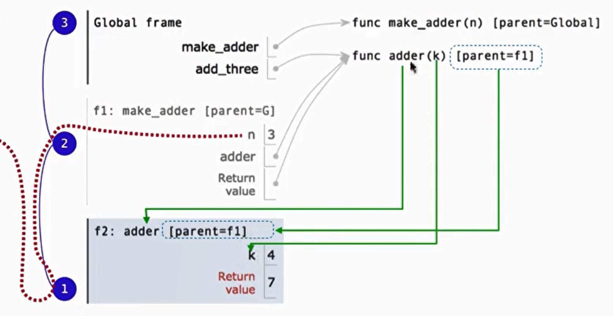

 UC berkeley - CS61A - 2024Fall - Structure and Interpretation of Computer Programs

## High-Order Functions 高阶函数

- express general methods of computation
    - 抽象化，black-box，一旦构建完成就不需要纠结里面的具体过程
- remove repetition from programs
    - 只需要定义一次
- separate concerns among functions
    - 每个函数只负责一个任务

从environment diagram来解释：

- Every user-defined function has a parent frame (often global)
- The parent of a function is the frame in which it was defined
- The parent of a function is the frame in which it was defined
- The parent of a frame is the parent of the function called

.



When a function is called:

1. Add a local frame, titled with the <name> of the function being called.
2. Copy the parent of the function to the local frame: [parent =< label>]
3. Bind the <formal parameters> to the arguments in the local frame.
4. Execute the body of the function in the environment that starts with the local frame.

“环境”是一系列frames,包括local frame和一路往上寻找的parent frame

### lambda  expressions


## Fuction Currying 函数柯里化

transforming a multi-argument function into a single-srgument, higher-order function.

## Names

Which values deserve a name?

- repeated compound expressions
- meaningful parts of complex expressions

典例：


A useful approach to implementing a function is to:

1. Pick an example input and corresponding output.
2. Describe a process (in English) that computes the output from the input using simple steps.
3. Figure out what additional names you'll need to carry out this process.
4. Implement the process in code using those additional names.
5. Determine whether the implementation really works on your original example.
6. Determine whether the implementation really works on other examples. (If not, you might need to revise step 2.)

Importantly, this approach doesn't go straight from reading a question to writing code.

## Data Representation

维护抽象屏障的目的是为了能够更改某些数据而不用重写整个程序

data abstraction uses selectors and constructors to define behaviour

If behaviour conditions are met, then the representation is valid → you can recognize data abstraction by its bahaviour ( not necessarily by how you construct it )

   

## Data Abstraction

isolate two parts of program that uses data using abstraction barriers:

- How data are represented (as parts)
- How data are manipulated (as units)

E.g., refer to the parts of a line (affine function) called f:
• slope(f) instead of f[0] or f['slope']
• y_intercept(f) instead of f[1] or f['y_intercept']
Why? Code becomes easier to read & revise; later you could represent a line f as two
points instead of a [slope, intercept] pair without changing code that uses lines.

| **类别** | **作用** | **设计时需注意** | **示例** |
| --- | --- | --- | --- |
| 构造器 | 创建和初始化数据对象 | 确保封装性，不直接暴露底层实现细节 | `tree(label, branches)` |
| 操作器 | 提取、访问、操作数据对象 | 不依赖数据的具体表示法（例如使用索引操作） | `label(tree)`, `branches(tree)` |

## Object 类 - List, Tuple & Dictionaries

class — a type of object

### objects can change

the same object can change in value throughout the course of computation

All names that refer to the same object are affected by mutation

only objects of mutable types can change: lists & dictionaries

tuples can’t be changed → can be used as the key to dictionaries

extend 和 append 的区别：

append就是把**全部当成一个元素**直接加进列表；

extend是元素**逐个**当成一个元素加入列表

```python
branch=[[1],[2]]
l=[]
l.append(branch) -> [[[1], [2]]]

l=[]
l.extend(branch) -> [[1], [2]]

```

tuple & list


“ same ”和” equal “也是有区别的：


identity : a is b

equality: a==b

例：a, b = s, s[:] 这里a就是s，但是b是s的副本

—> mutable default arguments are dangerous!

有关列表和树的好题：


## Iteration

built in functions for iteration:


数值被**惰性**计算 → 直到被调用的时候才计算 （当然如果想全部一次输出的话直接用list就可以全部计算了）

好处：指定的时候才计算

why iterators? → helps in data abstraction


## Generator

using `yield` instead of `return` 

is an **iterator** created automatically whenever u call the generator function

优势：

- 由于yield能返回多次，而return只能返回一次，所以不需要建立列表存储元素，直接yield就行了
    - 其中yield是返回一个值，yield from是返回一组值
- 如果只要前几位数据的话，可以直接生成。不需要像列表遍历一样先生成整个列表再取前几位，非常高效 → 占用内存少
- 适用于直接输出，不需要存储的情况
    - 由于直接输出的特性，对于有些（比如说：输出树的路径）的题目传统方式需要用[[]]这样的嵌套列表来存储、输出；但是yield就完全不用考虑

## Object-Oriented Progamming 面向对象编程

基于data abstraction 和 mutability的思想

思想：不是一串信息列表和函数，而是把程序看作是一堆不同的对象彼此交互

a metaphor for computation using distributed state

- each object has its own local state → mutation only take place locally
- each object also knows how to manage its own local state
- interacting with object using **method**
- several objects can all be instance of a common **class**
    - a **class** describes the behaviour of its instances
    - an **object** is an instance of a class; the class is its type
    - a **method** is a function called on an object using dot expression
- call a class like a function

attributes 属性：instance of the class


### Inheritance继承

适用于两个相似、只是专业化有所差异的类

与base case共享所有属性

只需指定哪些与base case不同

一些设计的原则：

- Don’t repeat; try using existing implementations
- Look up attributes on instances whenever possible

Inheritance & Composition

Inheritance: “is-a” relationship

Composition: “has-a” relationship

“Passing Messages”→ objects interacts by looking up attributes on each other

### Linked Lists 链表

A linked list is either empty or a first value and the rest of the linked list

由于链表天生的递归结构，处理他们的方式自然是以递归为主

与列表的比较：

插入和删除→链表更快

随机访问元素→列表更快


技巧：

使用递归：代码简洁，但所需栈空间大，调试难度低

使用迭代：借助”指针“帮助推进，代码量大但更高效，调试难度高

### List Efficiency 列表效率


列表生成式、附加是最快的；两个列表相加则很慢

### Object System VS Data Abstraction

前者：构造器+**隐式**选择器（dot expression)

后者：构造器+选择器

定义来说前者更简单，但调用几乎相同

### Efficiency  -  Order of Growth


对于很大的程序，进行”比较“等操作时，尤其要注意时间效率。

代码最简洁的方法不一定是最快的方法

### Modular Design 模块化设计

非常适用于大程序 → 通过抽象屏障分割各个板块

                             → 目的：分离关注点，每个板块只关注一件事

## Exception 异常

善用try..except，尤其是可能用户输入错误，但仍然想让程序继续运行的时候

```python
def invert(x):
    try:
        return 1/x
    except ZeroDivisionError as e:
        return 0
```
