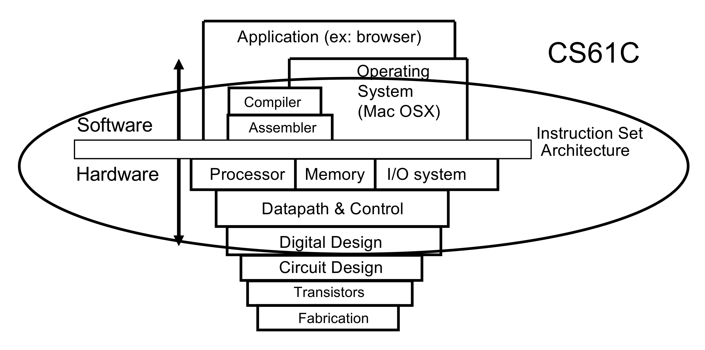

# 笔记

Status: Not Started
Project: CS (https://www.notion.so/CS-13eb34e8f75180fcb91bfe0b305925a7?pvs=21)
母任务: 5. CS61C:  Computer Architecture (https://www.notion.so/5-CS61C-Computer-Architecture-174b34e8f75180ff922ee8b631bba052?pvs=21)

# 1. 介绍

6 great ideas of computer architecture：

- Abstraction (level of representation/ interpretation)
- Moore’s Law
- Principle of Locality/Memory Hierarchy
- Parallelism
- Performance Measurement & Improvement
- Dependability via Redundancy



#1: Abstraction


---

# 2.  C语言相关语法

## 2. 浮点

1. 在传统数字表示方法下（二进制补码），我们没有办法表示分数

可能的解决方案：固定某个点作为分隔位


局限性：

- 我们没有办法充分利用有限的位数，而且如果固定选择某个位置，那么更小的数字精度可能会不足
    - 举例：0.1640625 → 000000.001010100000…
    - 许多位被浪费了！但是如果固定在其他位置，精度又会丧失
        - 如果小数点能浮动，不就解决了这个问题了吗（参考科学计数法）

1. 参考科学计数法构建


十进制的科学计数法


二进制的科学计数法

由于我们知道mantissa只能是1，我们可以干脆不记录它！


标准的浮点数表示法就是这样的32位，也就是C语言里的`float` ，也叫【单精度浮点数】

1. IEEE 754结构

转换器：[IEEE-754 Floating Point Converter](https://www.h-schmidt.net/FloatConverter/IEEE754.html)

局限性：

- 我们会发现，太小和太大的数都表示不了，分别造成underflow和overflow


- 我们都知道，指数是决定性的，那么我们通常可以直接比较两个数的指数来比较两个数的大小；同时我们希望能在没有浮点硬件的条件下比较浮点数（也就是通过比较整数的方式）
    - 而二进制补码有一个问题：负数看起来更大！
- 其次，当我们加减整数的时候，二进制补码完全没有问题，但对齐浮点数的指数就会变得比较麻烦→能不能换成正数呢？

解决方案：**偏置 Biased Notation**

就是把所有的负数全部换成正数的做法，省去了额外操作符号位的繁琐

IEEE 754结构采用的偏置数是**127**

由来：指数部分是8位，也即表示0~255；减去127，实际表示的就是-127~128

- 这里我们尽可能使正负各半，但是显然正数要多一个，这是因为正数使用频率更高，所以我们选择了127而不是128

Denorm：

我们还有一个问题需要解决：太小的数表示不了 - 这很大程度上是因为“1”的存在使得没有办法到达更小的数。

→ 所以我们选择不要这个“1”，直接用“0”

至于太大的数，我们也无能为力，最大也只能到那么大。

一些特殊数


- 到了指数为255的时，需要进位成2.x，但显然在十进制下不可能，于是看作是$\infin$
- 指数为255的时候，如果significand还有数字，相当于在$\infin$上加数，显然是无效的，于是看作是`NaN`

其他浮点数表示法

`binary64` 64位 - 也就是C语言里的`double` - 所谓的【双精度浮点数】


与`float` 的8位指数，23位有效位相比，`double` 有11位指数，52位有效位

- 可以一直表示到308次方，更加精确

当然还有：

- 4倍精度、8倍精度 - 高精度科学计算
- 半精度 - 高效计算，如机器学习

---

# 3. RSIC-V - Assembly Language Program

## 3.1 汇编语言

- CPU: 执行大量的指令(instructions)
- 不同的CPU有不同的指令集，称为 **指令集架构 Instruction Set Architecture (ISA)**
- 每一行操作的是一个指令，且直接操作**寄存器**
    - 所以不需要声明类型（没有类型之分，存储的都只是二进制位）
    - 【操作】决定了“类型” - 比如，是地址还是值


- 寄存器在处理器里，所以速度非常快


→ Great Idea #3: Principle of Locality/Memory Hierarchy 局部性原理/存储层次结构

## 3.2 RSIC-V 基础语法

- 有**32个**寄存器
- 每个寄存器都是**32位** （我们把32位称为一个单位”word”）
- 名字：
    - `x0` -`x31`
    - `x0` 是保留的，永远存放0
- 每一行只能一条instruction


- 算术指令语法都是1个operator, 3个operands - 为了权衡简洁和通用性


三个指令：`add`, `sub`, `addi` 

## 3.3 存储数据

- 由于数据一般都比32比特小（4字节），而大于8比特（1字节，如`char` )，因此如果一切都是8的倍数就很好办。
- 存储遵循Little-endian convention（小端字节序，由大地址往小地址填）
- load and store from memory to register
    - load → `lw`
    
    
    
    - store word → `sw`
- 当然也可以只load/store字节，而不是word（4字节）
    - `lb`, `sb` , `lbu` (不存在`sbu` 是因为存放的时候不需要解读，也就无所谓）
    - 注意：load之后会发生sign-extended
        - 因为只load了8个比特，还有24个比特是空的，如果都填0，但原数是负数，在解读的时候就会造成错误。
        - 举例：`11111110` （-2）
            - 不拓展：`00000000 00000000 00000000 11111110` - 254
            - 拓展：`11111111 11111111 11111111 11111110`
                - 取反+1：`00000000 00000000 00000000 00000010` - 2 → -2

## 3.4 选择语句

1. branches 分支
- `beq req1, req2, L1`   - branch if equal
- `bne req1, req2, L1`   - branch if not equal
- `blt` - branch if less than; `bge` - branch if greater than
- `bltu`, `bgeu` - unsigned版本
- 无条件分支: `j label`  - jump

## 3.5 逻辑指令

- `and` ，`or`
    - `and x5, x6, x7 # x5 = x6 & x7`
    - `andi x5, x6, 3 # x5 = x6 & 3`
    - 可以用作”masks”

## 3.6 函数调用

1. 主要可以分为六步：
- **把参数放在方程可以获取的地方**
    - 与高级语言直接传值不同，RSIC-V需要把参数放在特定的寄存器，由函数自己去获取
- **转移控制权到函数**
    - 执行流转到函数体
- **获取函数需要的局部内存资源**
    - 函数可能需要存储一些临时变量，这时就需要去堆中获取
- **执行函数**
- **将返回值放到调用代码可以访问的地方，并恢复使用的寄存器；释放局部内存**
    - 与函数调用值相同，下一步指令如果要调用返回值，也必须要把返回值放到特定的寄存器
    - 调用函数过程中会使用一些寄存器（比如传参的时候），那么用完了就要恢复原值
    - 如果使用了堆中的资源，需要释放
- **将控制权（或者说，程序指针）返回原始调用点**
    - 调用完函数之后需要回到原来的程序主体，继续后续操作。由于函数有可能在不同地方被调用，因此返回值不能“写死”，要确保是调用它的程序的位置

1. 函数调用的惯例
- `a0-a7` (x10-x17) 八个**参数**寄存器
- `a0` , `a1` **返回值**
- `ra` (x1) **返回地址**
- `s0-s1` (x8-x9),`s2-s11` (x18-x27)  **临时变量**


完整的命名惯例

1. 辅助指令
- `jal` - link and jump
    - `jal rd, FunctionLabel` (# rd = pc+4; pc += imm)  记录返回位置到`rd`，然后跳转到函数
    
    ```nasm
    Before:
    1008 addi ra,zero,1016 # ra=1016
    1012 j sum # goto sum
    
    After:
    1008 jal ra,sum # ra=1012, goto sum
    ```
    
    优点：减小大小、简单快速，不需要记住在哪里返回，让程序自己处理
    
    缺点： 受限于imm的范围限制（12位带符号值，所以跳转范围有限）
    

- `jalr` - link register and jump - `jal`的灵活版本
    - `jalr rd, rs, imm`  (# rd = pc+4; pc = R[rs1]+imm)
    - 跳转到`rs+imm`
        - 更加灵活，可以自己指定跳转地址
        - 由于可以自己指定起始位置(`rs`)，所以理论上来说可以跳转到任何位置

- 我们平时说的`j`, `jr` 实际上都是伪指令 (pseudoinstructions)
    - `j` - `jal x0, Label`

- 我们通常把寄存器原来的值存放在堆，其中堆的指针为`sp`


1. 函数调用举例

```nasm
//注：所有的寄存器序号都遵从命名惯例
// f=(g+h)-(i+j)
# initialize space
addi sp,sp,-8 # malloc space for 2 int
sw s1,4(sp) 
sw s0,0(sp)

# main function
add s0, a0, a1; # s0 = a0 + a1, f=g+h 
add s1, a2, a3; # s1 = a2 + a3, s1=i+j
sub s0, s0, s1 # s0 = s0 - s1, return f 

# restore space
lw s0, 0(sp)
addi sp,sp,8
jr ra
```

1. 嵌套函数

嵌套函数重要的一点在于，子函数可能会覆盖父函数的`ra` ，因此要注意提前保存父函数的`ra` ，并在子函数结束执行之后复写回去

```nasm
# int sumSquare(int x, int y) {
#   return mult(x, x) + y;
# }

mult:
    mul a0,a0,a1
    jr ra

sumSquare:
    addi sp,sp,-8 //分配内存
    sw ra,4(sp)  //存放下一条指令的地址，防止被覆盖
    sw a0,0(sp) //把原来a0里的数据存放起来，因为后面会被修改

    mv a1,a0
    jal mult //调用mult，结果存储在a0

    lw a0,0(sp) //恢复a0的数据
    add a0,a0,a1

    lw ra,4(sp) //大函数的地址
    addi sp,sp,8
    jr ra
```

---

# 4. RSIV-C - Machine Language Program

## 4.1 机器语言

1. 两个惯例
    - 任何事物（instructions, data words) 都有一个内存地址
    - 程序以二进制方式呈现（也就是汇编机器码）
2. 我们把32比特数据称为”words” 

## 4.2 RSIC-V 指令格式

- 由于大多数数据以”word“的形式呈现（也就是4字节），RSIC-V的指令因此是**固定大小的32比特**
- 一条指令被分为不同的”field”，用来告诉处理器这条指令的特定信息
- 出于简洁性，相似的指令有相似的格式
- RISC-V ISA的格式总共分为6个大类：

| Format | Description |
| --- | --- |
| R-Format | Register-register arithmetic operations |
| I-Format | Register-immediate arithmetic operations; Loads |
| S-Format | Stores |
| B-Format | Branches (minor variant of S-format) |
| U-Format | 20-bit upper immediate instructions |
| J-Format | Jumps (minor variant of U-format) |

## 4.3 程序指针 PC

一个处理器的内部寄存器（也就是说，跟其他寄存器分开的），专门用于存储当前执行指令的地址


示例：


程序指针相对地址 PC-relative addressing

`PC = PC + byte_offset` 

有时候我们希望能得到一个相对地址，也就是到某一个指令的字节偏移量。这样的代码就是”位置独立“的，即使整个程序的地址移动，也能正确移动到想要的地方。


如果地址写死了：`PC = new_address` ，代码如果移动了就会很难办

## 4.4 R-Format

> *用于寄存器-寄存器的常数运算*
> 

`opname rd, rs1, rs2` 


- 同一种指令具有相同的opcode （比如，所有的R-Format都是`0110011`）
- `funct7` , `funct3` , `opcode` 共同决定了要执行的操作 （至于为什么`funct7`和`funct3`不合并在一起，也是很有讲究的）


R-Format 指令全表（不需要记）

可以发现`funct3` 中用3位数字表示了10种指令（相似的指令具有相同的组合），而funct7则是在区分相似组合。

- 如`add` 和`sub` 具有相同的funct3, funct7中用1个`1`就可以区分了

## 4.5 I-Format

> *寄存器-常数运算；load*
> 

`opname rd, rs1, imm`

由于寄存器-常数运算只有1个寄存器参与，我们完全可以把本来放另一个寄存器的空间用来放常数，这样放常数的空间就变的特别大！

对比：


可见，我们可以存放12位数字（当然，在运算的时候CPU会自动sign-extend成32位，匹配运算的寄存器的位数）

由于逻辑几乎一致，指令格式几乎与R-Format相同


如果是load的话，逻辑也一样，只不过imm指的是偏移量罢了


load的时候同样也会自动sign-extend


其实还有比较特殊的`jalr` 也属于I-format，但为了连贯性我把它跟J-format[放在一起了](https://www.notion.so/179b34e8f75180ab99eefe8d3a6cb84c?pvs=21)

## 4.6 S-Format

> *存储*
> 

`storeop rs2, imm(rs1)`


之所以把imm拆成两半，是因为我们希望在不同类型中，寄存器的field不变，而imm相对而言没有那么重要，于是做了牺牲。


存储的时候不需要sign extension: 存储不需要解释值

## 4.7 B-Format

> *分支*
> 

`opname rs1, rs2, Label`


- 由于同样没有目标寄存器，格式跟s-Format一样。→ 我们同样有12位数字可以表示偏移量 （由于1位表示符号，因此可以表示$±2^{11}$个”单位“的偏移量）
- 这里的”单位“很有意思，由于偏移不能偏移到一个指令的中间，只能偏移到一个指令的开头，所以一般来说这个”单位“应该是4；但由于RSIC-V支持16b的压缩指令，所以就小的来说，”单位“应该是2字节；因此，实际的偏移量应该是2*imm
- 我们会注意到与S-format不同，这里的imm排列非常奇怪
    - 首先是我们可以看出序号不是原来的0-11了，而是1-12；正如右下角的例子所述，第0位永远是0，所以我们不需要存储它。这是为什么？正如前一条所说，实际偏移量是乘以了2的，所以imm要乘以2；而乘以2相当于左移1位！这就是为什么第0位永远是0
    - 同时，根据一般原则，我们希望field不变，也就是说`rs2`, `rs1` , `funct3` 的位置都不变，我们只能拆分imm
        - 第一种思路：左边存储[12:6]，右边存储[5:1]。这种思路很自然，但是有点违背我们的field尽可能不变的目标：变化的数字太多了！
        - 第二种思路：左边存储[12|10:5]，右边存储[4:1|11]。这种思路虽然有点奇怪，可是能保持变化尽可能少：11顶替少了的0，12顶替11
        


我们尽量保持field一致，尤其是寄存器一致，是为了将就硬件设计

B-format指令全表


引申：branch的跳转长度受限于位数（12），只能跳转到$±2^{10}$个32位指令（1位作符号位，1位用于支持16位压缩指令（开始乘以了2现在就要除回去！））如果想要跳转到更远的地方怎么办呢？

答案是换用 unconditional jump！


## 4.8 U-Format

> *当需要进行很大的偏移的时候使用*
> 

`opname rd, immed`


实际的`imm=immed<<12` 

1. `lui rd,immed` - `rd = immed << 12`

举例：

```nasm
//lui和addi配合使用可以在寄存器中生成一个32b值
lui x10, 0x87654     # x10 = 0x87654000
addi x10, x10, 0x321 # x10 = 0x87654321

//lui+addi可以用伪指令li（load immediate）来实现
li x10, x87654321 (直接load32位数字的超强指令）
```

但是，需要注意的是，使用`addi` 的时候，由于会自动sign extend，在加负数的时候可能会出现一些问题：


如图，如果加的是`0xAFE` （也即`1010 1111 1110` ，是一个负数），那么会自动填充1，也即`0xF` 。可是这样看的话就会发现，如果把竖式分为左右两边，左边相当于莫名其妙从upper 20-bits减了1了！

解决方案  

- 对阵下药：当12立即数是负数时，先给upper 20-bits加1
- 巧妙做法：直接使用`li` ！它会自动处理
    
    
1. `auipc rd,immed` - `rd = PC + (immed << 12)` 
- 与`lui` 的区别在于除了immed以外还加了PC → 我们能预想到这会有多有用，这正是我们跳转时经常用到相对地址！由于immed升级到upper 20-bits后数字可以变得特别大，能给我们带来比j-format更大的范围
- 使用场景
    - 刚刚提到的，与`jalr` 搭配使用，处理超大的偏移量
    - 把PC的地址存放到某个寄存器供使用
        - 举例：`auipc x5, 0 # puts address of Label in x5`

## 4.9 J-Format

> *跳转；实际上是U-Format的一个变种*
> 
1. `jal rd, Label` - jump and link

`PC = PC + offset ; rd = PC + 4`

应用：

- 标准的跳转然后回来
- 伪代码`j` (=`jal x0, Label` )
    - 简化版的`jal`，只跳转，不管地址


- 现在有20位imm了，可以跳转$±2^{18}$个32位指令（更多了！解决了前面用branch我们提到的烦恼。但是，如果还想要跳转的更远呢？）
- 同样是遵循最少修改原则进行imm的重新排序
    - 最高位肯定在第一位，挤走原来的11
    - 下一个方块紧接其后本来应该存放的[4:0]，但是由于没有0了，恰好就被11顶替
    - 下一个方块放剩下的元素[19:12]
    
1. `jalr rd,rs1,imm` - jump and link register 

*实际上是I-format，因为和`jal` 在结构设计上有很大的不同（虽然功能类似）*

`PC = rs1 + imm, rd = PC + 4` 

- 可以发现，与`jal` 默认的起始点为自己不同，`jalr` 可以指定起始点，更加灵活→ 这也就意味着理论上来说我们可以覆盖任何地方！
- 应用：
    - 回到父函数
    
    ```nasm
    //也就是伪指令jr ra （实际上是jalr x0, ra, 0 )
    jr ra ->  jalr x0, ra, 0
    ```
    
    - 通过绝对地址调用函数，并保存返回地址
    
    ```nasm
    lui x1 <hi20bits>
    jalr ra, x1, <lo12bits>
    ```
    
    - 跳转到相对于PC很大偏移量的地址
    
    ```nasm
    auipc x1 <hi20bits>
    jalr x0, x1, <lo12bits>
    ```
    
- 为什么它归于I-format？
    - 结构：
    
    
    
    - 我们会发现，这里的imm不再乘以2了。
        - 这是因为，因为前面的所有乘以2的指令都是相对于PC（也就是当前位置）而言的，所以乘以2之后也一定是对齐/半对齐的
        - 但是这里我们的起始点是灵活的，没有办法保证偏移量对齐；所以我们只能跟最开始那样要求偏移量必须是以4字节为单位 - 当然这也就意味着`jalr` 不能支持16b压缩指令

---

# 5. 编译、汇编、链接和加载

> *CALL - Compiling, Assembling, Linking, and Loading*
> 

### 5.1 翻译和运行一个程序 - CALL


1. 如何运行一个程序？
- 翻译器（Translator） ：转换到其他语言
    - 翻译/编译到低级语言往往意味着更高的效率和更好的性能
    - 可以隐藏原始代码
- 解释器（Interpreter）：直接执行
    - 没有中间步骤，效率较低，但对于调试和学习很有用
    - 或者是对效率没有很高的要求的时候
    - 指令集独立：代码不要为特定的硬件服务，而是可以运行于任何机器

1. 编译和运行一个C语言程序的步骤


当然了，平时我们运行的时候都是一步到位，直接就到后面的`a.out`了。

### 5.2 编译器 Compiler

- 输入：高级语言代码 （e.g., `foo.c`)
- 输出：汇编代码 （e.g., `foo.s`)
    - *注：汇编代码可能会包含伪指令（如`mv`, `j` , `li` 等*

### 5.3 汇编器 Assembler

- 输入：汇编代码 （e.g., `foo.s`)
- 输出：机器语言模块 - 目标文件(Object File) （e.g., `foo.o`)
    - 包括目标代码（机器语言）
    - 包括链接和调试的信息 （Symbol Table, Relocation Information, Data
    Segment, etc.）
- 读取并使用指令(directives）
    - 这是程序中特殊的汇编指令：指示如何组织代码，比如定义全局变量或数据段；可以理解为划分为不同的“板块”供汇编器参考
    - 通常是由编译器生成的（前一个步骤）

| 类型 | 描述 |
| --- | --- |
| `.text` | Subsequent items put in user Text segment (machine code) |
| `.data` | Subsequent items put in user Data segment (source file data in binary) |
| `.globl sym` | Declares sym global and can be referenced from other files |
| `.string str` | Store the string str in memory and null-terminate it |
| `.word w1 ... wn` | Store the n 32-bit quantities in successive memory words |
- 将伪代码转换为真正的汇编代码 → 然后转换为机器语言

1. Object File格式
- **目标文件抬头（Object File Header）**：目标文件中其他部分的大小和位置。
- **代码段（Text Segment）**：机器代码。
- **数据段（Data Segment）**：源文件中静态数据的二进制表示。
- **符号表（Symbol Table）**：文件中label和静态数据的列表，可以被其他程序引用。
- **重定位信息（Relocation Information）**：需要由链接器稍后修复的代码行。
- **调试信息（Debugging Information）**

1. 转换为机器代码
- 简单的情况：运算、逻辑、移位 - 所有的信息都已经在指令里了
- PC-relative branches and jumps：(`beq`/`bne`/etc. and `jal` )
    - 这些都是位置独立代码Position-Independent Code (PIC)
    - 计算这种PC-relative地址的时候，我们都要扫描程序**两次**
        - 这是因为，向前引用的时候，我们还没见过这个label，根本不知道他在哪里！
        - **第一遍 (Pass 1)**：扫描整个程序，**记录所有标签 (label) 的位置**，并将这些标签位置存储在一个符号表（symbol table）中
        - **第二遍 (Pass 2)**：利用在第一遍中记录的标签位置，计算所有的偏移量，并生成最终的机器代码。
- 如果是其他的引用呢？比如引用别的文件、引用静态数据，这些引用我们在汇编的时候无法确定，只能在下一步链接的时候确定。所以我们先把这些引用记录下来，这就用到了**定位信息表 (Relocation Information)** 和 **符号表 (Symbol Table)**
    - **符号表 (Symbol Table)**：
        - 这个目标文件里的所有”东西“
        - 存储标签（label）、外部函数、变量(`.data` 里的所有东西）等的名字和它们的位置或地址 - 以便链接的时候能很方便地替换
    - **重定位信息表 (Relocation Information)**：
        - 这个目标文件所需要其地址的”东西“ （List of "items" whose address this file needs）
            - 所有的要跳转到的外部地址 （比如库函数，例：`jal ext_label` ）
            - 所有在静态区的数据 （例：`la` ）
        - 存储需要动态调整地址的指令位置，以及如何调整它们的信息。
    

注：

- 之所以会有所谓的”外部地址“，是因为目标文件其实是模块化的。也就是说，一个大程序被拆分为了各个模块，每个模块生成一个模块文件，在下一阶段链接的时候再进行合并
- 对于C语言而言，一个`.c` 文件通常对应了一个`.o`
- 模块化处理的优势有很多
    - 允许程序员并行开发
    - 编译效率高：如果程序被修改，编译的时候只需要重新编译受影响的目标文件。这样就不必全部重新编译

### 5.4 链接器 Linker

- 输入：目标文件（e.g., `foo.o`)
- 输出：可执行的机器代码（e.g., `a.out`)
    - 包括代码、数据段、文件抬头、调试信息


链接器会合并所有的目标文件

- 先是合并`txt` 和`data`部分
- 解决引用问题：然后合并`info` ，这里链接器会遍历重定位信息表，然后补充所有的绝对地址（所有的信息都在这里了）
1. 再来谈一谈重定位信息表。哪些数据需要重定位？
- ❎ PC-Relative Addressing (PC相对寻址)
    - 如`beq`, `bne`, `jal`, `auipc/addi`
    - 位置无关代码，偏移量在编译的时候就确定了，不受程序加载基地址影响
- ✅ External Function Reference (外部函数引用)
    - `jal`或`auipc/jalr`
    - 只有当链接器整合了所有信息才知道地址
- ✅ Static Data Reference (静态数据引用)
    - `lw`, `sw`, `lui/addi`
    - 数据段的位置在运行的时候可能会被修改（因为是绝对位置），所以只有在链接的时候才能决定

1. 具体解释链接器怎么解决引用问题
- 对于RV32，链接器驾驶第一个代码段从地址`0x10000` 开始
- 链接器知道一些信息，用来计算实际的内存地址：
    - 每个代码段或数据段的长度（比如函数的指令有多少字节）。
    - 代码段和数据段的顺序，即它们在内存中的布局方式。
- 链接器负责计算：
    - 每个标签的绝对地址（比如跳转到某个函数的确切位置）。
    - 每个数据的绝对地址（比如全局变量在内存中的位置）。
- 链接器如何解析引用：
    - 先从”用户“ 的symbol table寻找引用的名称（函数名或变量名）
    - 如果找不到，就去库函数的文件找
    - 确定了绝对地址，就填进去

1. 静态VS动态链接
- **静态链接 - 整个库成为程序的一部分，会一起嵌入到可执行文件中**
    
    > *稳定性、独立性*
    > 
    - 优点：完全自包含，不依赖外部文件运行
    - 缺点：
        - 更新困难：如果库更新了，那么整个文件就得重新编译
        - 体积大：即使只用了这个库的一小部分，占的内存也是一整个库
    
- **动态链接 - 程序运行时加载的，引用外部文件**
    
    > *共享性和灵活性*
    > 
    - DLL: Dynamically-Linked Libraries
    - 广泛运用于windows和unix系统
    - 优点：
        - 体积小：多个文件可以共享一份dll
        - 更新方便：由于是引用，所以更新库不需要重新编译
    - 缺点
        - 兼容性、安全性问题：由于依赖于外部库，外部库如果不能正常操作，整个程序就会崩溃
        - 性能开销：由于依赖于外部库，加载时间可能会对运行时间产生影响

| **特性** | **静态链接库** | **动态链接库** |
| --- | --- | --- |
| **依赖性** | 无需依赖外部库，程序自包含 | 依赖外部库，缺失或版本不符会导致运行失败 |
| **文件大小** | 可执行文件包含整个库，文件体积较大 | 可执行文件较小，多个程序共享库文件 |
| **更新与维护** | 需要重新编译程序才能获得库的更新 | 库更新后，所有依赖程序自动使用新版本，无需重新编译 |
| **性能** | 加载时性能更高，无需动态加载 | 程序运行时需要加载库文件，启动速度可能稍慢 |
| **兼容性** | 无版本兼容问题，程序总是运行在已知的库版本上 | 存在版本兼容性和 ABI 不稳定问题，可能导致运行失败 |
| **安全性** | 库代码直接嵌入，较难篡改 | 动态库被篡改可能影响所有依赖程序 |
| **适用场景** | 嵌入式系统、独立发布的软件 | 桌面应用、大型复杂系统、操作系统模块 |
| **模块化与共享性** | 模块化支持较差，多个程序重复包含相同的库代码 | 多个程序共享库文件，节省内存和磁盘空间 |
| **部署复杂性** | 部署简单，可执行文件独立运行 | 需要确保目标系统上存在正确版本的库文件 |

### 5.5 加载器 Loader

- 输入：可执行代码（e.g., `a.out`)
- 输出：（程序跑起来了）
- 可执行文件存储在磁盘上，因此加载器要把它加载到内存上开始运行
- 实际上，加载器就是操作系统本身；加载是操作系统的职责之一

具体操作：

- **分配内存并加载程序到这个空间**
    - 读取可执行文件头信息：提取文本段和数据段的大小。
    - 创建新地址空间：分配一个足够大的内存区域以容纳文本段、数据段和栈段。
    - 复制内容：
        - 把程序的指令和数据从可执行文件拷贝到新的地址空间。
        - 把传递给程序的参数放到栈中，供程序使用。
- **初始化寄存器**
    - 大部分寄存器会被清零
    - 栈指针（SP）指向起始地址
- **启动程序**
    - 从栈加载程序参数到寄存器。
    - 设置程序指针（PC）：指向程序的起始指令。
    - 如果程序的主例程（main routine）执行完毕，启动例程会通过退出系统调用（exit system call）终止程序运行。

### 5.6 示例程序 - Hello world

1. 编译：`hello.c` → `hello.s` 


注意到，代码段用的是`.align 2` ，而数据段用的是`.balign 4` 

- 这是因为`.balign 4` 明确了数据长度为4字节（因为写的是多少肯定就是多少）；
- `.align 2` 则比较模糊，可能像之前提到的“单位”一样，实际上表示的2*2=4字节，也有可能表示的是2字节。这相当于把选择权交给了目标平台，让平台自行决定选择更好的
- 不过当然了，直接给数据段使用`.balign` 完全没有问题，甚至更好

1. 汇编：`hello.s` → `hello.o`  


1. 链接：`hello.o` → `a.out`


实际计算的时候这里会+1：


### 5.7 总结

- **编译器 (Compiler)**：将单个高级语言文件 (HLL file) 转换为单个汇编语言文件 (assembly language file)。
- **汇编器 (Assembler)**：
    - 删除伪指令 (pseudo-instructions)。
    - 尽可能将内容转换为机器语言 (machine language)。
    - 为链接器 (linker) 创建检查表 (重定位表 relocation table)。
    - 进行两次遍历 (2 passes) 以解析地址，处理内部前向引用 (internal forward references)。
- **链接器 (Linker)**：
    - 将多个 `.o` 文件组合并解析绝对地址 (absolute addresses)。
    - 支持单独编译 (separate compilation)，无需重新编译的库可以被链接，并解析剩余地址。
- **装载器 (Loader)**：将可执行文件 (executable) 加载到内存并开始执行。

---

# 6. 硬件架构描述

> *Hardware Architecture Description*
> 


现在我们由最底层开始，逐步往上一层

## 6.1 宏观介绍

1. **同步数字系统 Synchronous Digital Systems （SDS）**
- 一种数字电路设计范式，在这种系统中，电路的各部分以一个共同的时钟信号（clock signal）为基准同步运行

1. **晶体管**
- 用来放大或者切换信号的半导体元件
- 之前：真空管； 之后：集成电路（IC)，微处理器

1. **晶体管网络**
- 现代数字系统都是构建于CMOS（互补金属氧化物半导体）- 作为电压控制开关
- MOS Transistors（金属氧化物半导体晶体管）
    - 三个端口：drain, gate ,source
    
    
    

1. **电路类型**
- 组合逻辑电路（Combinational Logic (CL) circuits）
    - 只与输入有关
- 状态元件（State Elements）
    - 保存信息的电路（比如说寄存器）

1. **信号与波形**
- 时钟


- 分组 grouping


很多时候，不同的波之间周期起始点相对于时钟周期会有所差异。

如果我们直接进行操作（比如加法）的话可能会造成混乱（因为根本不知道应该加哪一个值）

因此，我们把多个波合并成一个（这样也能表示更多的状态）


## 6.2 组合逻辑  Combinational Logic

1. **逻辑门**


1. **布尔代数**


布尔代数可用于简化电路

布尔代数法则：

|  |  |  |
| --- | --- | --- |
| $x \cdot \overline{x} = 0$ | $x + \overline{x} = 1$ | Complementarity |
| $x \cdot 0 = 0$ | $x + 1 = 1$ | Laws of 0's and 1's |
| $x \cdot 1 = x$ | $x + 0 = x$ | Identities |
| $x \cdot x = x$ | $x + x = x$ | Idempotent law |
| $x \cdot y = y \cdot x$ | $x + y = y + x$ | Commutative law |
| $(xy)z = x(yz)$ | $(x + y) + z = x + (y + z)$ | Associativity |
| $x(y + z) = xy + xz$ | $x + yz = (x + y)(x + z)$ | Distribution |
| $xy + x = x$ | $(x + y)x = x$ | Uniting theorem |
| $\overline{x} \cdot \overline{y} = \overline{x + y}$ | $\overline{x + y} = \overline{x} \cdot \overline{y}$ | DeMorgan's Law |

## 6.3 状态  State

1. **触发器**

寄存器的实质其实就是n个触发器(“Flip-Flop”)


D代表数据，Q代表输出；32位的寄存器就有32个Flip-Flop

由时间信号0-1的变化触发。


我们发现，从采样到输出有一定的延迟。如果数据在采样前疯狂变化的话，我们难以确定采样得到的是什么，也就成了一堆垃圾。于是我们要求输入信号在采样前一段时间内必须保持稳定，也称”register set-up time”


1. **举例（adder）**


$S_i=S_{i-1}+X_i$，其中：

- $S_{i-1}$是寄存器上一个时钟周期的输出 （这是为了能再不耗费额外存储空间的情况下执行循环操作）
- $X_i$是当前时钟周期的新输入
- $S_i$是累加器当前时刻的输出

每个时间周期执行两个操作：

- 获取新值$X_i$（供加法器使用）
- 执行加法运算$S_i=S_{i-1}+X_i$ （并将结果保存在寄存器）

上面举的例子是从寄存器获得$S_{i-1}$的时候恰好也获得$X_i$，但是实际上不会那么凑巧


这样的话可能会有一小段时间（图中阴影部分）出现$X_0+X_0$的情况，这显然不是我们想要的，不过没关系，因为设计良好的电路一般都会避免这种情况：

> *即使使输入信号短暂不稳定或发生了延迟，良好的电路设计和时序控制（如时钟信号的同步、适当的时序裕度等）确保了寄存器会在时钟沿来临时捕获正确的稳定值。*
> 

1. **流水线优化技术（pipelining）**

最大的时钟频率是多少？也即最短的周期是多少


Max Delay = CLK-to-Q Delay + CL Delay+Setup Time

这意味着我们的时钟间隔最短也得要有这么长，不然还没计算完就来了新的数据，造成混乱

我们可以通过插入额外的寄存器来加速时钟速率并提高输出效率


以整条操作中含加法器和移位器为例

流水线中的额外寄存器就像接力棒：

- **原来的问题：**
    - 一个长操作（比如加法器 + 移位器）可能需要 10 纳秒完成，所以时钟周期必须 >= 10 纳秒。
- **现在的解决方案：**
    - 在加法器和移位器之间插入一个寄存器，数据先存下来，再交给移位器处理。
    - 优势：
        - 加法器和移位器可以并行工作，彼此互不等待。
        - 每个寄存器的操作延迟可能只有 5 纳秒，因此时钟周期可以缩短到 5 纳秒。
- 也就是说，单个元件的延迟没有改变，但是由于流水线中同时处理的元素变多了，运行速度也可以提高
- 当然，这意味着如果整条流水线里有**更多的关键元件**（比如加法器、移位器、乘法器等）且它们本身的延迟较长，那么增加寄存器的优势确实会更加明显。


更多额外的寄存器带来更高的效率

总结关键点：

- 分割任务
- 并行处理
- 减小关键路径延迟

1. **名词整理**
- **时钟 (CLK)** - 稳定的方波，用于同步系统
- **建立时间 (Setup Time)** - 输入信号在时钟上升沿到来之前必须保持稳定的时间
- **保持时间 (Hold Time)** - 输入信号在时钟上升沿之后必须保持稳定的时间
- **时钟到Q的延迟 (“CLK-to-Q” Delay)** - 从时钟上升沿开始到输出发生变化所需的时间，也就是前一个寄存器输出到下一个寄存器的传输时间
- **触发器 (Flip-flop)** - 一个状态位，在每个时钟上升沿进行采样（正沿触发）
- **寄存器 (Register)** - 包含多个状态位的组件，在时钟上升沿或加载（LOAD）信号触发时进行采样（正沿触发）

1. **有限状态机（FSM）**

举例：连续输入3个1的时候输出1


硬件实现：

- 我们需要一个寄存器来存储当前状态（每个状态具有特殊的形式）
- 一个组合逻辑电路（CL）用来映射当前状态（PS）+输入和下一个状态（PS）+输出


那么怎么实现CL呢？我们可以借助FSM图，也可以借助真值表


1. **一个同步系统的一般模型**


- 一般是CL模块以寄存器分隔
- CL模块可以是背靠背的，寄存器也可以背靠背
- feedback是可选的
- 时间信号只与寄存器相连

1. **系统设计的模型**


1. **总结**
- 状态元件（如Flip-Flop）用来：
    - 构建存储单元
    - 控制CL与其他状态元件的信息流
- 时钟告诉我们什么时候flip-flop变化
    - setup和hold time非常重要
- 对于高延迟的CL，我们使用流水线技术优化
- 有限状态机非常有用！
    - 简化复杂系统的设计：将复杂系统的行为分解成一组**有限**的状态和状态转换
    - 清晰的状态和控制：清晰地定义系统在任何时刻的状态，使得状态之间的控制更加**可预测**，减少了出错的可能性

## 6.4 组合逻辑模块 CL Blocks

### **6.4.1 多路选择器 multiplexors**

输入两个数据a/b，依赖S决定输出哪一个数据


1b的选择器，构造很巧妙


如果是4b的选择器呢？


我们可以利用“等级制”或者说类似于逐级选择的方式巧妙的构造

note：**$S$位的多路选择器可以选择$2^S$个输入**

### **6.4.2 算术逻辑单元 （ALU）**

具有多种功能，根据控制指令S（由CPU发送）选择执行哪一项指令

一个简单的例子：


具体实现同样用的是我们所说的“逐级选择”逻辑：


### **6.4.3 加法器/减法器**

1. 回想一下面对一个复杂的“黑箱”，我们如何构建？
- 核心思想：看看能不能把大问题按规模或者按等级拆分成更小的、我们能解决的问题
    - 列出真值表
    - 确定标准形式（canonical form）
    - 化简（利用布尔代数）
    - 利用已经实现的次底层元件组装（比如我们可以使用`XOR`等等）

以1b加法器为例：


对于最低位，写出真值表后我们发现s0和c1分别可以用`XOR`和`AND`实现


到了下一位我们发现情况更复杂，但仍然可以拆分成我们已知的部分（`XOR` 和`MAJ` )


这样我们就有了具体实现的思路

而实际的加法器是多位的，我们只需要拼接在一起就可以了


但是这样有潜在的问题：如果进位太多或者其他原因，有可能会发生**溢出**；我们怎么确定什么时候会发生溢出呢？


红色框圈起来的就是出现了overflow的算式

- 如图所示，我们拿2位数来测试加法器的时候（主要是因为枚举数量少），会出现overflow；
- 总结规律我们发现（思想！），overflow的值等于$c_nXORc_{n-1}$

1. 减法器

减法器的构造：我们完全可以利用加法器的组件，也即$A-B = A + (-B)$


一个非常非常巧妙的减法器的设计

- 我们知道，正数的补码就是本身，负数的补码是取反再加1
- `XOR`的逻辑是$x⊕0=0,\:x⊕1=∼x$（取反）
- 所以对于B，我们可以利用上`XOR` 的逻辑，先处理一下B；如果B是正数就不变，是负数就取反
    - `XOR` 在这里扮演的是条件选择+取反的作用
- 但是对于负数，取反之后仍然需要加1，所以我们直接把sub的参数当成$c_0$传入！

### 6.4.4 总结

- 对于需要很多选择、很复杂的模块，我们可以分级布置Mux
- ALU可以利用Mux来搭建（与基本逻辑单元搭配）

# 7. 数据通路 Datapath

### 7.1 CPU结构/阶段

1. **CPU = Datapath+Control**
- CPU：进行数据计算和决策
    - 数据通路（“肌肉”）：执行处理器要求的操作
    - 控制单元（“大脑”）：告诉数据通路需要做什么


1. **抽象化**

我们上升一个抽象层次，把具体的实现全部看作一个个黑箱模块（“blocks”）


1. **目标 - 每周期一条指令的RSIC-V机器**

CPU由两部分组成：组合逻辑块和状态元件

每一个时钟周期内：

- 【状态元件的输出】移动到【组合逻辑块】
- 【组合逻辑块的输出】在下一个时钟上升沿前稳定在【状态元件】前

在时钟上升沿：

- 所有【状态元件】更新为【组合逻辑块的输出】
- 开始下一个时钟周期


图例

### 7.2 状态元件

适用于**RV32I ISA，也即`PC` ; `Reg` ; `MEM`**


1. 程序指针`PC`  - 是一个32位的寄存器


- 输入：
    - N位数据
    - 写入权限”控制“位
- 输出：
    - N位数据
- 行为：
    - 当写入权限为1且处于**时钟上升沿时**，输入数据=输出数据（允许改变）
    - 其他时候，输出保持不变
        - 有点像flip-flop的原则，只有允许改动的时候输出才改变为输入，其余时候无论输入什么都不变
        - 更进一步的是，这里要求同时满足写入权限和时钟上升沿两个条件，这是有目的的

具体分析行为：

PC的行为只有两个，顺序操作的`PC=PC+4` 和跳转的`PC=PC+imm` 

绝大多数情况下，无论是顺序操作还是跳转，写入权限都常为1；

当遇到数据冒险（如后一条指令需要读取前一条指令的结果，但是前一条指令还没有计算完成），这时需要插入一个【停顿周期】，暂停程序运行，也即PC不动 → 我们就可以依靠写入权限为0来做到，这样就能使地址一直”hold“

当然在我们理想的”每周期一条指令的RSIC-V机器“中，这样的情况不存在

1. **寄存器文件 Register File `Reg`  - 32个32位的寄存器**


- 输入：
    - `dataW` ：要写入的32位数据（通常由后续的ALU返回）
    - `rsW` : 也即我们常说的`rd` ，要写入数据的寄存器编号（只有有权限时才有效）
    - `rs1` , `rs2` ：要读取数据的两个寄存器的编号
    - `RegWEn` ：写入权限”控制“位（因为有些操作只读，所以我们需要设置这么一个开关）
- 输出：
    - `data1` ,`data2` ：从`rs1` , `rs2` 抓取的数据
- 行为
    - 与PC不同，当“只读”的时候，`Reg` 的行为跟一个【组合逻辑块】一样：只要`rs1` ,`rs2` 有效，内存会立刻把对应的数据输出到`data1` ,`data2` ，无需等待时钟信号
        - 换句话说，时钟信号只是控制【写入】的
    - 为什么？这是因为二者的性质有本质差异
        - PC是控制作用，必须控制程序按时钟周期有序进行
        - “写入”操作修改了程序，而这会影响程序的其他部分；因此需要听从时钟信号指令按顺序执行 - 【顺序逻辑】
        - 而“只读”相当于“查找“，由于没有修改，所以无论什么时候调用不会影响程序的其他部分，因此完全可以不听从时钟信号，类似于组合逻辑块 - 【组合逻辑】
        
1. **内存**


我们拆分成两个不同的场景：

- 指令存储： `IMEM`  **（只读） - 行为与组合逻辑块相同**
- 数据存储：`DMEM` （加载-只读；存储-写入）

### 7.3 如何构建数据通路？


这样完整的数据通路非常难下手构建

我们考虑把整个过程拆分成不同的”阶段“，然后通过连接小的阶段组成完整的数据通路

思想：模块化

5个基本的阶段


1. 获取指令地址 `IF` 
2. 解码指令 `ID`  - 从IMEM中获得地址对应的具体质量
3. 执行 `EX` 
4. 存储数据 `MEM` 
5. 必要时复写寄存器 `WB`  （也即返回值）


至于数据通路中的选择，如Mux、写入权限等，这些是由控制逻辑决定的

### 7.4 构建R-Format

 以`ADD` 和`SUB` 为例

回顾add：`add rd, rs1, rs2` 


函数对处理器状态有两个影响：

RegFile: `R[rd] = R[rs1] + R[rs2]` 

PC: `PC = PC + 4` 

以下是`add` 数据通路的实现：


（这里的操作暂时还用不到DMEM，所以我们先忽略）

这下就能看出来为什么我们在规定寄存器的field的时候希望不同的指令field的位置尽可能相同 - 因为我们提取地址的时候就能反复利用！

注：`rsW` 也就是机器语言的`rd` ，在一开始就传入`rsW` ，但是存入的数据`dataW` 用的是`Add` 计算结束的返回值；也就是说，写入是发生在**返回值生成后的下一个周期**，要这个周期有写入权限才行，而不是传地址的周期。

那么，如何实现`sub` 呢？其实逻辑跟`add` 完全一致，只是计算的时候用的是sub而已，所以我们可以使用一个`Mux` 来选择，而选择的逻辑就交给control logic — 当然还要把提取的数字传递给control

换句话说，在构建数据通路的过程中，对于功能类似的操作我们往往会共用路线，因此会产生非常多的支路组合。而control logic的作用就在于决定哪些支路”有用“/”忽略“

于是有了改进版：


这样的逻辑可以支持所有R-Type的操作，只需要在ALU选择就可以了


### 7.5 构建I-Format - 常数操作

这是I-format的前半部分。虽然由于常数操作和存储格式相同被归在了同一个format，但是逻辑完全不同，于是构建数据通路的时候也分开实现。

`addi rd, rs1, imm` 


函数对处理器状态有两个影响：（与前面几乎一致，除了加的是常数而非寄存器）

RegFile: `R[rd] = R[rs1] + imm`  

PC:  `PC = PC + 4` 

因此，我们需要改动两处：


1. 处理输入常数的问题 
- 先把`rs2` 给替换成常数 — 通过Mux来选择
- 对于常数，我们提取之后要拓展位，所以需要一个”立即数生成器“


完整通路：


dataR2仍然会输出，只不过我们选择的时候忽略了这个支路

立即数生成器的原理（拓展位）：


### 7.6 构建I-Format - 存储

这是I-format的后半部分。

`lw rd, imm(rs1)` 

数据通路应该与`addi`相似，只不过常数运算得到的是我们想要的数据的地址，而不是数据本身 → 在ALU之后还要读取数据

影响的状态元件：

DMEM： 读取数据

RegFile：`Reg[rs1] # read; Reg[rd] # write` 

PC：`PC = PC + 4` 

改动：


增加了DMEM，同时利用Mux来选择分支。如果是load，就把值看作地址，返回相应的值；要不就直接返回值。

当然图里的摆放不是最高效的，把Mux直接放在ALU之后才是；可是到了后面会很麻烦，这种反而更加高效了。

完整通路：


补充：RV32I支持载入不同位数，如`lb` ,`lh` ，只需要额外加一个筛选逻辑就可以了，这里省略了。

### 7.7 构建S-Format

`sw rs2, imm(rs1)` 

- 同样可以利用上一个版本计算存放地址`addr=imm+rs1` ，可是我们会发现，计算地址的时候，`R[rs2]` 被选择掉了，但我们实际上是需要它作为DMEM中的`dataW` 的 — 需要一条通路直接连接`R[rs2]` 和`dataW`
- 同时，由于`sw` 多了一个寄存器参数，imm被分成了两部分，所以imm生成器的逻辑也应该有两个 — 我们给imm生成器也加入一个选择逻辑


改动：


注意到，这个操作没有返回值，所以WBSel传值无所谓，填`*` 

完整通路：


### 7.8 构建B-Format

与S-Format类似

`opname rs1,rs2,Label` 


- imm生成器的逻辑要变动
- PC现在在一定条件下会变动了！

影响元件：

RegFile：`R[rs1], R[rs2]` 只读，用来比较

PC： `PC = PC + imm` （如果分支）

     `PC = PC + 4` （如果不分支）


有两处区域我们需要修改逻辑

改动：

(1) 比较`R[rs1], R[rs2]` 

- 可是我们会发现对于比较来说，1个ALU根本不够（ALU一般只进行运算，比较大小属于逻辑判断器的范畴，所以我们只能先计算两数之差，再与0相比较得到大小关系，这就需要两个ALU才行；更不用说还需要计算新地址PC+imm，这就需要3个ALU）
- 所以我们只能把原有的ALU用来计算PC+imm（更符合我们前几个的实现逻辑），然后在ALU之前额外增加一个比较器
    - 而我们至少需要两个子元件才能完全知道信息，也即”是否相等“，”是否小于“

- 实现如下：
    
    
    

- 宏观简略图


- 我们之前把整个数都传给了control，现在我们需要他通过`BrUn` 告诉我们这个数是不是Unsigned，这样我们才能正确判断大小
- 比较器返回结果`BrLT` 告诉control是不是小于，`BrEq` 告诉control是不是等于，然后由control决定是分支还是不分支 — control通过`PCSel`告诉Mux是+4还是+imm

(2) PC的逻辑要利用Mux改动为选择逻辑，其中一个分支为PC+imm，而我们前面确定了imm将由ALU返回，于是直接接到ALU上就行了

完整通路：


补充：imm的变动是最大的，所以imm生成器的变动也很多，现在来看看。

- 对于I，S-Format：拓展的最高位都在首位，所以直接拓展就好；imm[4:0]的选择则交给Mux


- 对于B-Format：最高位仍然是一致的，imm[4:0]的位置也类似于S-Type，只是imm[11]的位置有所不同，所以在S和B之间增加一个Mux选择器


### 7.9 构建跳转函数

1. **`jal rd, Label` 属于J-Format**


- imm生成器又要修改了
- 受影响的状态元件
    - PC `PC=PC+imm`
    - RegFile `rd=PC+4`  -现在我们需要增加一条通路，把PC+4得到的结果返回寄存器

修改如下：


完整通路：


1. **`jalr rd,rs1,imm` 属于I-Format**


受影响的状态元件：

- PC：`PC = R[rs1] + imm` — 这个逻辑也有了
- RegFile：`R[rd] = PC + 4`  — jal用了相同的，所以可以不增加

改动：无需改动

完整通路：


### 7.10 构建U-Format

`opname rd, immed` 


- imm生成器又要修改了
- 受影响的状态元件
    - PC：`PC = PC + 4`  — 这个有了
    - （`Lui` ）RegFile：`R[rd] = imm` — 通路有了，只需要稍微修改一下逻辑
    - （`AluPC` ）RegFile：`R[rd] = PC + imm` — 无需修改

改动：通路无需改动，修改逻辑：对于ALU，我们不需要计算，直接输出imm就可以了

`Lui`完整通路：


`AluPC` 完整通路：


### 7.11 完整的RV32I数据通路


---

# 8. 控制

### 8.1 时间效率

以`add`为例：


一个周期等于$T=T_{clk-q}+T_{logic}+T_{setup}$


对于`add` 而言,$T_{logic}=max(T_{Add}+T_{mux},\:T_{IMEM}+T_{Reg}+T_{mux}+T_{ALU}+T_{mux}+T_{steup})$，只不过跟后面的相比，前面的PC时间无关紧要 → 在计算时间的时候，我们往往只考虑最主要、时间最长的路径

对于整个逻辑的周期，我们肯定要将就时间最长的操作，也就是`lw` （五个阶段都有）


- 这样的话我们的指令集效率就只有$f_{max}=\frac{1}{800}ps=1.25GHz$，显然不够优秀。当然因为我们假设是单周期机器，所以整个过程中有很多元件被空置了，我们可以把它们利用起来。
- 如果能够充分利用所有元件，没有空置（像流水线一样），那么理论最大频率可以达到$f_{max,ALU}=\frac{1}{200}ps=5GHz$

### 8.2 实现控制逻辑


控制逻辑真值表

1. 控制逻辑的实现有两种主流方式：**ROM**和**组合逻辑（CL）**

比较：

- ROM：
    - 结构简单、规则，很适合实现复杂逻辑
    - 可轻松重新编程
    - 手动设计控制逻辑的时候非常流行：让复杂的设计变得易于实现
- 组合逻辑：
    - 主流方法，性能高，低成本
- ROM仍然有市场（如嵌入式系统中固定功能的存储，洗衣机、遥控器等重复性任务）
    - 组合逻辑不需要存储真值表，可是实现逻辑电路的硬件成本会增加；如果是少量逻辑或者小规模需求（如遥控器），ROM反而内存更小 → 当然现在被FGPA逐渐取代
    - 对于重复性任务，ROM更加高效：表很小，查找速度很快（$Θ(1)$）；而逻辑电路每次都需要动态计算
    - 对于这种简单任务，用CL显得“杀鸡用牛刀”
- 大规模电路
    - ROM的实现是一种类似于查表的结构，先解码然后查表得到指令。理论时间复杂度为$Θ(1)$。可是实际上尤其是规模大的时候并不高效：
        - 类似于哈希表，虽然时间复杂度为常数，可是额外的操作如解码、传播的延迟会显著增大。因此随着规模的增加这个“常数”会变的非常大，丧失了$Θ(1)$的优势。
    - 并行性：组合逻辑电路可以并行很多操作，而ROM只能是线性的
    - 规模拓展的时候，逻辑门的设计更容易控制面积，而大规模 ROM 会显著增加芯片面积和功耗。
    - 优化潜力高：设计人员可以通过逻辑优化（如门级优化、布尔代数简化）减少延迟，而 ROM 由于结构固定，优化空间有限。

1. **RV32I是一个9位的ISA**

用9位我们就能区分所有的指令


- `inst[6:2]` 用于区分大类
- `inst[14:12]` 用于区分大类里的操作（泛分类，相似的操作被划分为相同的代码）
- `inst[30]` 用于区分一些相似操作（如`Add` 和`Sub` ）

1. **ROM实现方式**

抽象来看，就是输入数据位，返回指令


具体实现中，是一种类似于查表的结构，先解码然后查表得到指令。理论时间复杂度为$Θ(1)$。可是实际上尤其是规模大的时候并不高效。


1. **CL实现方式**

实现非常简单


# 9. 流水线

### 9.1 衡量性能

- 衡量计算机的性能有很多方面，比如程序执行时间、数据吞吐量、能耗等等
- 优化程序执行时间(time per program)
    - 三个组成部分
    
    
    
    - Instructions per program决定于：
        - 使用的算法
        - 进行的任务
        - 使用的编译器
        - 使用的编程语言
        - 使用的ISA
    - Average clock cycles per instruction (CPI)决定于：
        - 使用的ISA
        - 处理器的实现方式和微观架构（比如数据通路）
    - Time per cycle (1/frequency)决定于:
        - 处理器微观结构：最关键路径
        - 技术：晶体管密度
        - 能耗：低电压会降低晶体管性能
- 能耗 (energy per program)
    - instructions per program提过了，energy/instruction的增长潜力空间已经越来越小
    
    
    
- 吞吐量(tasks per second)


### 9.2 流水线概念

前面我们提到了如果一个时钟周期执行一条指令，会有相当多的元件空置。因此我们可以适当地重叠指令，尽可能少的空置元件。这就是流水线的概念。

→ 等待时间（完成一项任务所需时间）不变；

→ 吞吐量（单位时间内完成的任务数量）增加了

发现：

- 吞吐量最大加速比=阶段数
    - 本来都空置，现在全部利用（当然头尾有填充和清空成本（filling/draining))
- 流水线整体速率取决于最慢的阶段（木板效应）
    - 因此尽可能平衡各阶段的长度是加速的关键

### 9.3 RSIC-V中的流水线

- 周期优化

单指令周期（示例）：


优化后，单个周期内有多条指令：


- 数据通路

整个数据通路分为5部分：


由于单周期设计中，所有操作在一个周期内完成，到了流水线中我们就要考虑这样操作带来的潜在危害：我们需要存储阶段间的信号，防止出现数据混淆（否则前面的步骤计算结束的非常快，直接就到了下一个阶段了，会与后面的信号发生混淆）

→ 使用**寄存器**来暂存结果，下一个时钟信号再传输到下一级


优化：我们发现同时传输了`PC` 和`PC+4` ，这显然没有必要


现有的控制逻辑不能满足流水线的需要：最开始我们就把inst[31:0]传给了控制逻辑，并在后面的阶段使用的都是这个指令；但是流水线中我们期望的是前面的刚解码完，下一条指令就可以开始解码了，这就意味着原有的逻辑需要修改。

- 不能直接把指令传给控制逻辑就不管了，所以我们需要让指令跟着流水线往前走，同样使用一个寄存器，保证节奏的统一。
- 控制逻辑的格式发生了变化（比如左下角和右下角出现了延伸到外面的通路），这里暂时先不考虑，后面会有用。


同时又由于本来我们的WB指令不会发生变化，直接解码完使用即可，现在流水线中解码完得到的不一定是原来的地址了，因此我们需要等到流水线传递到WB的时候，把指令再传给`RegWriteData` 。


流水线中的控制信号有两种实现思路：

1. 每个阶段都有一个独立的控制逻辑子电路（图中用的就是这一种）
    - 流水线中传递的的是指令(instruction)，在每个阶段动态生成需要的信号(signal)
2. 只有一个控制逻辑子电路
    - 解码（ID）之后就马上计算所有的控制信号
    - 传递的是所有的信号

对比：

1. 适合需要高度灵活性、并行度较高或特定阶段有复杂控制需求的场景（高性能处理器）
    - 灵活性高：每个阶段可以独立调整逻辑
    - 故障隔离：如果某个阶段的控制逻辑出现问题，只影响该阶段，不会波及其他阶段
    - 动态适应性强：控制信号在各个阶段动态生成，可以应对指令执行中的不确定性
    - 缺点：硬件消耗大、设计复杂、延迟累积
2. 适合资源有限的设计（嵌入式处理器）
    - 节约硬件、设计简单、延迟小
    - 不灵活、如果故障影响范围大

---

## 9.4 冒险

### 9.4.1 结构冒险

当流水线中两条或以上的指令同时要访问一个元件。

解决方案：

- 轮流来：“等待”
- 增加更多硬件
- 设计ISA的时候就避免这样的冲突

RSIC-V使用的就是方法3，设计的时候就避免了这样的可能

（例：RegFile每周期可以读取两个值。没有RISC-V指令需要一次读取3个或更多寄存器）

### 9.4.2 数据冒险

> 最容易发生的类型
> 

三种情况及举例：

- **读后写 (RAW - Read After Write) - 最常见**
    - I: `add x1, x2, x3` (x1 = x2 + x3)
    - J: `sub x4, x1, x5` (x4 = x1 - x5)
    如果 J 在 I 将结果写入 x1 之前执行，J 就会使用 x1 的旧值。
- **写后读 (WAR - Write After Read)**
    - I: `lw x1, 0(x2)` (x1 = Memory[x2 + 0])
    - J: `add x2, x3, x4` (x2 = x3 + x4)
    如果 J 在 I 读取 x2 之前执行并修改了 x2 的值，I 就会读取到错误的地址。
- **写后写 (WAW - Write After Write)**
    - I: `add x1, x2, x3` (x1 = x2 + x3)
    - J: `sub x1, x4, x5` (x1 = x4 - x5)
    如果 J 在 I 将结果写入 x1 之前执行，x1 的最终值将是 x4 - x5，而不是正确的 (x2 + x3)。

解决方案：

1. **阻塞 (Stall/Bubble)**
    
    插入空指令（气泡）来延迟后续指令的执行，直到数据可用。
    
    - 空指令的一个例子是`nop = addi x0 x0 0`
    - 一般都是由编译器自行插入的
    
    
    
    解决前：数据冲突
    


解决后：插入`nop` 来延缓执行

1. **数据转发(Data Forwarding/Bypassing)**

“读后写“的发生通常是由于`WB`还没更新；有没有办法能够计算得到的结果直接传给下一条指令呢？这样下一条指令也可以不用读取了。

可是实际上计算的结果早就得到了，只是还没更新；有没有办法能够计算得到的结果直接传给下一条指令呢？这样下一条指令也可以不用读取了。

（也就是【计算→写入→读取→计算】的操作简化为【计算→计算】


改进前


改进后

增加的这条通路能够在计算结束后直接回到下一条指令的计算位置供使用


当然这个Mux需要选择，所以我们需要把下一条指令传给控制逻辑，让它决定是否选择上一条指令留下的计算结果，而不是读取得到的尚未更新的错误数值

“写后读”的逻辑会更复杂一些，因为即使把读取的数据马上传递给ALU也会来不及。


那么这种情况我们只能等待一个周期，然后在模仿上面的思路把读取的数据马上传递


只能多等待一个周期


增加通路，读取到数据之后马上传给ALU

完整的数据通路（加上把指令传递给控制逻辑，让控制逻辑决定是否使用由ALU/内存传递来的值）


1. **指令调度 (Instruction Scheduling)**

插入`nop` 毕竟还是造成了浪费：如果在这个时间里能够执行一些不受影响的指令呢？

思想：**重新安排**指令的执行顺序，以减少或消除数据依赖

例子：


注：上述方法都需要编译器与硬件协调完成

- 编译器：指令调度、插入空指令
    - 当然前提是编译器需要知道数据通路的结构
- 硬件：阻塞、数据转发

### 9.4.3 控制冒险

如果要跳转的话，我们是在`EX` 阶段（t3）决定是否跳转的，可是这个时候已经有一些指令进入流水线了，而这不是我们想要的！→ 我们需要把这些指令全部转换为`nop` （这个过程也叫刷新流水线(flushing))


问题：我们浪费了3个周期！万一是不跳转而是继续执行下一步，那不就是浪费了吗。

解决方案：猜测分支

- 一般来说，我们的数据通路都是猜“不跳转”，允许下面的指令进入流水线；如果猜错了再刷新。
- 平均来说，这样做会提高性能（比起一看到分支语句就刷新来说），因为多少也会猜中一些！

## 9.5 超标量处理器

1. **RISC-V ISA 的设计是为了流水线操作**
- **定长指令**
    - 易于在一个时钟周期内取指，并在一个时钟周期内译码。
    - 与 CISC（R = 精简，C = 复杂）ISA（如 x86）形成对比：指令长度可变，从 1 到 15 个字节不等，这带来了很大的复杂性
- **少量标准指令格式**
    - 可以在一个阶段译码指令并从寄存器中读取数据。
- **简单的加载/存储寻址**
    - 在第 3 阶段（EX），使用 ALU 计算地址。
        - RISC-V采用加载/存储架构，这意味着只有加载和存储指令才能访问存储器。所有其他指令都只操作寄存器中的数据。这种设计简化了指令的执行过程。
    - 在第 4 阶段（MEM），访问存储器。
- **存储器操作数对齐**
    - 存储器访问只需要一个周期。

1. **还能怎么提高呢？**
- 增加时钟周期：被科技限制❎
- 增加流水线长度❎
    - 重叠会更显著→更多冒险会发生→更多的空指令→更慢
    - 每个阶段做了更少工作→更短的时钟周期
- 设计一个超标量处理器✅
    - “超标量”：增加执行单元的数量来提高并行性，是**空间上的并行**
    - →一个时钟周期内并行执行多条指令→多条流水线、更复杂的调度逻辑

3.**超标量处理器**

顺序启动→乱序执行→顺序提交

- **多指令**：每个时钟周期启动多条指令
    - 多个执行单元并行执行指令
    - 每个执行单元都有自己的流水线
    - CPI < 1：每个时钟周期完成多条指令
- **动态**“乱序”执行
    - 在硬件中动态地重排指令，以减少冒险的影响


---

# 10. 缓存

## 10.1 为什么需要缓存

- 类比一个很大的图书馆，为什么拿书耗时很长？
    - 找书时间长：索引数量大，映射时间长
    - 来回运输书的时间长：内存离处理器很远，来回运输延迟会很大
- CPU的性能增长很快，但是内存访问速度的增长远不及那么快；因此性能的差距会导致内存的低效会显著影响CPU的性能。

---

## 10.2 怎么实现缓存 - 宏观概念

1. **为什么需要缓存**

同样是类比图书馆，加入我们要写一个报告，需要很多参考书，在一个大图书馆里面来回穿梭需要不少时间，所以我们一般的策略一般都是先找好书然后统一放在桌子上。这样写报告的时候就不用写一段找一本书。

缓存的目的也是类似的，我们总是希望能够随手就能拿到数据，即使需要来回查找也尽可能少。→ 缓存实际上就是从内存复制一部分我们正在或很快就会用到的数据


1. **缓存的构建基于局部性原则：**
- 时间局部性：如果我们现在访问了某个数据，很可能不久后还会再次访问它
    - →将最近访问的数据项保存在更靠近处理器的位置（把书放在桌子上，而不是一本一本找）
- 空间局部性：如果我们访问了某一块内存，很可能很快会访问它相邻的内存块
    - →将由连续字组成的内存块移动到更靠近处理器的位置（一次拿一堆书）

1. **如何设计缓存？有几个问题需要考虑**
- 如何映射内存到缓存？
    - 缓存是内存的子集，所以很多个内存地址一定会映射到同一个缓存地址，如何解决冲突？或许可以借鉴哈希表的解决方案？
- 怎么知道缓存里有哪些元素？
- 如何快速定位这些元素？

1. **计算机存储层次结构（Memory Hierarchy）是如何管理的**
    
    寄存器（Register）→ 缓存（Cache）→ 主存（RAM）→ 磁盘（Disk）
    
- 寄存器↔内存：编译器/汇编语言程序员
- 缓存↔主存：缓存控制硬件（这正是我们需要设计的）
- 主存↔磁盘（二级存储）：操作系统（虚拟内存）

1. **缓存的意义**

在于给处理器一个假象，认为内存无限大且无限快 — 抽象的力量

---

## 10.3 直接映射缓存 (Direct-Mapped Cache)

前面提到了我们希望一次从主存中提取的数据最好是多个字节一起拿，不然显得效率低下，因此我们一次拿取的单位称为“块(block)”。

- 直接映射：表示**每个内存块（Block）只能映射到缓存中的唯一位置**（一个固定的缓存行），这是一种最简单的缓存映射策略
    - 这是一种类似哈希表的操作，当然这意味着同样会有冲突的发生


以block size为1字节为例

实际上block size可以是任意数值。至于在缓存中如何区分，只需要在原地址中加以区分（比如Block size为2的时候，使用0和1就可以区分左右）


block size为2字节的情况

虽然我们能够在一个block里面区分元素了，但是我们提到了会发生地址冲突，怎么样知道这个block是不是我想要的block呢？

与哈希表的冲突解决不同，我们不能逐个比较元素，因为我们是“读”，还不知道里面的元素是什么。

思路：类比在机场拿行李，很多人的包可能相同，这就类似于“地址冲突”。如果我们想拿包里的物品，虽然我们能够区分包里的物品了，但我们还是要先能够区分是不是自己的包。这个时候我们通常会先盯住跟自己包长得一样的包，然后通过看包上的“标签”，来进一步确认是否是自己的包。

解决方案：这里我们可以利用类似的思想，为每一个地址打上”标签“，这样就能区分了。

标签可以直接用地址，但是只用其中的一部分

- 缓存数远小于地址数，因此不需要那么多
- 只要能够区分的数量就可以了


tag举例

实际运用中，缓存数量、每个block存储的字节数都会变动，因此我们采用类似于RSIC-V ISA 的设计思路，把地址划分为三个field：


- `index`  - 缓存索引：哪一”行“/block是我们需要检查的
- `offset`  - 偏移量：找到了block之后，检查哪一个字节
- `tag` - 标签：用于区分被映射到同一个缓存块的内存地址

*注：检查顺序是**”Index → Tag → Offset“**：类比找箱子：

- 先找到长得像自己箱子的箱子 — 通过index找到对应的行
- 通过上面的行李标签确认是否是自己的箱子 — 比较tag确认整个block是否是想要的
- 打开箱子找到对应位置的物品 — 通过offset在bloc里面找到对应的元素

*注：全部都是unsigned integer

*缓存大小（byte）=(block index) *(byte offset)


举例：`lw t0, 0(t1)` ,t1包含地址$1022_{ten}$，`Memory[1022]=99`

如果没有缓存：

- 处理器将地址$1022_{ten}$传给内存
- 内存读取$1022_{ten}$的word`99`
- 内存把`99` 传给处理器
- 处理器把`99` 放到`t0`

如果有缓存：

- 处理器将地址$1022_{ten}$传给缓存
- 缓存检查是否有地址$1022_{ten}$的拷贝
    - 如果有(hit)：缓存把`99`传给处理器
    - 如果没有(miss)：缓存把地址传给内存
        - 内存读取$1022_{ten}$的word`99`
        - 内存把`99` 传给缓存
        - 缓存存储`99`
        - 缓存把`99` 传给处理器
- 处理器把`99` 放到`t0`

---

## 10.4 缓存术语

1. **缓存术语**

当读取内存的时候，可能会有3种情况：

- cache hit：缓存block有效且含有有效地址→直接读取
- cache miss：正确的block里面啥都没有→从内存中获取
- cache miss, block replacement：正确的block里面有东西，但是不是我们想要的（地冲突了）→从内存中获取，直接覆盖

1. **缓存”温度“**
- Cold：缓存是空的 - 缓存刚开始工作
- Warming：缓存正在填充数据 - 缓存正在学习哪些数据是常用的
- Warm：缓存工作正常，命中率适中 - 存储了一些常用数据，可以部分加快访问速度
- Hot：缓存工作良好，命中率高 - 存储了大量常用数据，显著加快访问速度

1. **描述命中的术语**
- Hit rate
- Miss rate
- Miss penalty: 如果miss了，从内存的更低结构加载到缓存所需的时间
- Hit time: 访问缓存元素的时间

*细节：当缓存”cold”的时候，缓存里没有任何有效的信息，所以我们在tag上可以附上一个”有效位“提示一下（不然有可能tag有可能与地址相同而造成错误） — 当然这个有效位主要是在后面其他类型的缓存的时候才特别有用，用于只是这个位置是否是空的。

1. **miss的种类**

“Three Cs” Model of Misses

- **Compulsory Miss — 数据首次访问**
    - 也称为冷启动缺失。这是因为第一次启动程序的时候缓存还啥都没有，所有块必然会有一次miss。因为很难解决所以我们先不关注。
- **Conflict Miss — 缓存映射策略导致的冲突**
    - 发生在**直接映射缓存**中。不同的内存地址映射到了同一个block中
    - 解决方案
        - 1：把缓存弄大一点：会出问题❎
        - 2：修改映射策略：如果不同的内存地址能同时存在于一个block呢？✅
- **Capacity Miss  — 内存不足以存放所有活跃数据**
    - 内存不够了，有些数据会被淘汰、替换

如何区分是哪一种miss？这里有一个巧妙的算法：

- 首先，考虑一个无限大小的完全关联缓存（Fully-Associative Cache）。
对于每一个发生的miss，都将其视为Compulsory Miss
- 其次，考虑一个有限大小的缓存（你希望检查的大小），并且是Fully-Associative的。每一个不在第1步中的miss，视为Capacity Miss
- 最后，考虑一个有限大小的缓存，并且是有限关联的。所有剩下的miss，如果不属于第1步或第2步，则视为Conflict Miss

---

## 10.5 实现

在完成抽象的规则构建后，我们要开始利用这些规则具体构建缓存。

一个例子：


多字块直接映射缓存 (Multiword-Block Direct-Mapped Cache)

在实现的过程中我们会发现许多问题：

1. **如何进行write-hit?**

write-hit指的是CPU需要写入某个数据，而这个数据恰好在缓存中。

我们有两种思路：

- Write-through（写直达）
    - 同时更新缓存和主存
    - 因此可以想象，延迟会非常大：每一次写入都要访问主存
- Write-back（写回）
    - **只更新缓存 — 允许主存中的数据是”过时的“**
    - 什么时候必须要写回？
        - 当缓存块被替换的时候（比如缓存满了，需要腾出当前块给新的数据）
        - 操作系统主动清空缓存（比如I/O操作），以确保最新的数据以写入主存
    - 那我们就应该标识该块与主存不同，这样在替换的时候把标记过的统一更新
        - 引入”dirty bit”作为标识
        - 如果该缓存块被修改过，dirty bit设为`1`
        - 当该块被替换时，如果dirty bit为`1` ，必须将其写回主存
    - 这样就会非常快，但是我们就要面对缓存-主存数据不一致的问题，需要权衡

权衡：

- 数据一致性 — Write-through
- 高性能 — Write-back

1. **如何选择block大小？**
- 大block的优点
    - 空间局部性：一次拿的东西多，更有几率不用再访问内存
    - 适用于存储程指令流、数组：指令的执行通常是顺序的
- 大block的缺点
    - 更大的miss penalty
    - 如果$\frac{block大小}{内存大小}$太大的话，block的数量就会变少：
        - 数据多样性降低/如果程序访问多个不相邻的元素(如哈希表) — miss rate显著升高
    - 最坏情况：Ping Pong 效应
        - 如果一个数据被访问了，之后很可能还会被访问，但它不会马上被访问，而是在未来某个时间才会再被用到。然而，在未来访问它之前，它已经被缓存淘汰了，导致再次访问时又是 Miss（未命中）！这样，缓存不断地加载新数据，同时不断地丢弃即将用到的数据，导致缓存效率极低。
        - 表现：
            - 所有数据都曾经进过缓存，但在真正再次用到之前就被淘汰了。
            - 导致几乎每次访问都要从主存中加载，缓存完全失去作用！
            - CPU 频繁等待主存访问，程序性能极差！


选择block size需要反复权衡

---

## 10.6 全关联缓存(Fully Associative Cache)

为了[改进conflict miss](https://www.notion.so/179b34e8f75180ab99eefe8d3a6cb84c?pvs=21)而提出的方案。

原理：

- 缓存没有固定的映射方式（例如直接映射或组相联映射）→ 每个内存块可以存储在缓存中的任何空闲位置。
- 当 CPU 发出内存访问请求时，缓存会遍历所有的缓存行，检查请求的数据是否存在。

设计改进：

- 没有”rows”了：任何block可以去到缓存的任何地方
- 必须与缓存中所有的tag比较来确定数据是否存在

优点：不会有conflict miss了；唯一的miss就是capacity miss

缺点：查找过程慢（需要逐个对比而不是类似于查表）；硬件开销大


需要相当多的寄存器

那么我们能不能找一种折中的方案呢？

---

## 10.7 相关联缓存(Set Associative Cache)

一个折中的方案。

既用上了直接映射带来的速度快，又用上了完全关联的随机性（本质上是允许一个区块存放多个block）：冲突不会太多， 硬件开销也不会太大

这里我们使用的是set。一个set可以存放多个block。set的index是计算得到的，set内则是随便放。（有点类似于头等舱和经济舱，分开两个区域，但是在区域内可以随便坐）

这么看的话，我们会发现directed-mapped和full-associative实际上是set-associative的两种特殊情况：

- 前者是1个set大小为1个block — 1-way set assoc
- 后者是1个set大小为整个缓存 — M-way set assoc

或者也可以这么说：

- cache is direct-mapped w/respect to sets
- each set is fully associative with N blocks in it

变化：TIO中，`Index`变成了指向对应的set


2-way为例。这里的N-way指的是一个set存放block的数量

执行步骤：

- 通过`index`找到正确的set
- 比较set中所有的`tag`
- 如果匹配，hit！反之miss
- 反之，与往常相同，利用`offset` 来定位block中想要的元素


4-way的硬件实现示例

*注：需要根据具体情况进行取舍，在极端情况下2-way并不一定会比DM更好

举例：访问`0, 2, 0, 4, 0` 

表现：

- DM：     0m, 2m, 0h, 4m, 2h
- 2-way：0m, 2m, 0h, 4m, 2m

---

## 10.8 块替换规则

> Block replacement policy
> 

当我们需要写入块的时候，会出现两种情况：

- 如果有invalid block，直接写入该块
- 如果全都是valid，就要选择一个块来写入。选择的方法有很多，这就叫【块替换规则】

1. **LRU（Least Recently Used）**

选择最久访问的数据块。

优点：充分利用了时间局部性

缺点：如果是2-way，只需要1个LRU-bit就可以区分；如4-way及以上则需要更复杂的硬件和时间

1. **FIFO（先进先出）**
2. **随机**

---

## 10.9 性能评估与提升

### 10.9.1 宏观概念

依据什么标准来权衡associativity, block size, replacement & write policy?

答案是【平均内存访问时间】Average Memory Access Time(AMAT)

**AMAT=Hit time + Miss Penalty x Miss Rate**

（之所以hit time不用加上hit rate是因为无论miss还是hit都需要完成缓存-CPU的运输操作！）

减少miss rate的方法前面提到过了，无非就是解决冲突miss（容量miss和强制miss很难有办法解决，因为更大的缓存首先受制于科技，而且更大意味着更长的延迟），而这已经在set-associative cache里很好的解决了。

因此我们只需要尽可能减少miss penalty

### 10.9.2 减少miss penalty - 多层缓存

miss penalty指的是主存-缓存的时间。这看起来很熟悉，因为减少CPU-主存时间的时候我们采用的方式就是构建一个缓存，那么我们能不能在缓存-主存间再构建一些缓存呢？（套娃）


Second Level (L2) Cache


两层缓存的AMAT分析思路

典型规模：

L1：

- 大小：几十kb
- hit time：一个时钟周期内完成
- miss rates: 1-5%

L2:

- 大小：几百kb
- hit time：几个时钟周期
- miss rates: 10-20%

*为什么L2的miss rate这么高？这是因为：

- L2的miss rate是先在L1miss了再到L2miss
- 而L1的miss rate不高，这意味着到L2的数据本身量也不大，难以学习
- 再者，能被L1miss的说明很多都不符合局部性原则，到了L2也难以利用局部性原则，因此miss rate较高
- L2 miss rate较高并不意味着很差劲，比较L1miss的”劣质数据“仍然有相当多被L2兜住了！


有L2

### 10.9.3 实际CPU


无L2


intel core i7

CPU的进步：

1. **架构进化与复杂度增加**

- 早期的 PowerPC 处理器是单核架构，主要强调缓存（L1 和可扩展的 L2）、流水线（超标量，3 指令/周期）和执行单元（6 个执行单元）。
- Intel Core i7是一个多核架构，拥有多个核心（6 核或更多），并且有共享的 L3 缓存。这表明现代 CPU 通过增加核心数提高并行处理能力，而不仅仅是依赖更高的时钟频率或更深的流水线。

2. **缓存设计的变化**

- 早期 PowerPC 主要依赖较小的 L1 和外部 L2 缓存，意味着当时的设计需要额外的芯片或主板支持 L2 缓存。
- Intel Core i7 采用了较大的 **共享 L3 缓存**，多个核心可以同时访问。这减少了核心之间的数据传输延迟，提高了多线程任务的效率。

- 早期 CPU 更依赖高时钟频率和更深的流水线，而现代 CPU 主要通过多核和更优化的缓存架构来提升性能。
- 现代CPU一般就是三层缓存

---

## 10.10 总结

- 核心思想：如果一个东西代价很大而我们需要重复做，只做一次然后把结果缓存（树里面也有这样的思想）
- 缓存设计的变量：
    - size of cache
    - block size (i.e., cache aspect ratio)
    - Write Policy (Write through v. write back)
    - Associativity choice of N (direct-mapped v. set v. fully associative)
    - Block replacement policy
    - 2nd level cache?
    - 3rd level cache?
- 使用性能模型（AMAT）来选择不同的变量，如程序、科技、预算

---

# 11 并行

## 11.1 Flynn 分类法

**大前提：软硬件的并行性是独立的**

|  |  | Software |  |
| --- | --- | --- | --- |
|  |  | Sequential | Concurrent |
| Hardware | **Serial** | Matrix Multiply written in MatLab running on an Intel Pentium 4 | Windows Vista Operating System running on an Intel Pentium 4 |
|  | **Parallel** | Matrix Multiply written in MATLAB running on an Intel Core i7 | Windows Vista Operating System running on an Intel Core i7 |

软硬件并行性不相同的时候也能运行，只是性能不是最佳

FLynn分类法分类的是硬件

### **11.1.1 单指令/单数据流(SISD)**

> Single Instruction/Single Data Stream (SISD)
> 


在任意时刻只执行**一条指令**，并且这条指令作用于**一个数据流。**

应用 - 通用计算

- 单核CPU（例如我们前面构建的CPU）
- 嵌入式设备
- 单线程计算任务（文本处理等）

为什么：

- 顺序执行适合一般任务：大多数日常任务是按顺序执行的，不需要并行处理，如加载网页
- 设计简单

### **11.1.2 单指令/多数据流(SIMD)**

> Single Instruction/Multiple Data Stream (SIMD)
> 


在任意时刻执行**一条指令**，但该指令作用于**多个数据流**。典型特征：数据级并行（DLP, Data Level Parallelism）

应用：

- GPU（如像素渲染，每个像素的颜色计算可以使用相同的公式 → 也就是说，CPU适合少量复杂逻辑任务，GPU适合大量重复计算
- 人工智能、科学计算：大量的矩阵-矩阵乘法

为什么：

- 提高吞吐量：SIMD 允许 GPU **一次性处理多个数据**，而不是逐个计算像素或矩阵元素。
- 减少指令开销：单次指令即可并行操作多个数据，避免 CPU 那种每次只对一个数据执行指令的低效方式。

### **11.1.3 多指令/单数据流(MISD)**

> Multiple Instruction/Single Data Stream (MISD)
> 


**同时执行多个不同的指令**，但这些指令**都作用于同一个数据单元**

应用：

- 容错计算
- 航天飞行器控制
- 冗余计算

为什么：
为了确保数据计算正确，**不同的计算单元用不同的算法处理同一个数据流**，然后比较结果。这种设计保证了即使某个处理单元出错，系统也能通过其他单元的结果进行纠正。

### 11.1.4 多指令/多数据流（MIMD)

> Multiple Instruction/Multiple Data Stream (MIMD)
> 


**同时执行多个不同的指令**，每个指令作用于**不同的数据单元。也就是所谓的多线程。**典型特征：任务级并行（TLP, Task Level Parallelism）或者叫[线程级并行(TLP, Thread Level Parallelism)](https://www.notion.so/179b34e8f75180ab99eefe8d3a6cb84c?pvs=21)

应用：

- 现代多核CPU
- 云计算（需要同时处理不同用户的请求）
- 高性能计算/大规模分布式计算（科研、大规模神经网络训练等。既能任务级并行又能数据级并行）

### 11.1.5 总结

| 架构 | 指令流 | 数据流 | 主要应用 | 为什么？ |
| --- | --- | --- | --- | --- |
| **SISD** | 单指令 | 单数据 | 传统 CPU，嵌入式系统 | 顺序任务，不需要并行 |
| **SIMD** | 单指令 | 多数据 | GPU，AI 计算，科学计算 | 数据级并行，提高吞吐量 |
| **MISD** | 多指令 | 单数据 | 航天器、容错计算 | 冗余计算，确保可靠性 |
| **MIMD** | 多指令 | 多数据 | 多核 CPU，云计算，超算 | 任务级并行，提高计算能力 |

---

## 11.2 SIMD架构

核心概念：数据级并行（DLP）

性能提升的来源：

- 一条指令完成整个操作
    - 传统方式需要 `n` 条指令，而 SIMD 只需要 1 条指令来处理 `n` 个数据
- 计算是独立的
    - 每个 `i` 的计算不会相互影响，可以同时执行，提高并行度
- 流水线优化 & 并发访问内存
    - 由于数据是 **连续存储** 的，可以高效利用缓存，提高内存访问效率


举例：想要处理一个数组，把每个元素都开平方

```c
//pseudocode
for each f in array:
		f = sqrt(f)

//SISD
for each f in array {
	load f to the floating-point register
	calculate the square root
	write the result from the register to memory
}

//SIMD
for every 4 members in array {
	load 4 members to the SSE register
	calculate 4 square roots in one operation
	write the result from the register to memory
}
```

问题：既然GPU本身就是为了并行运算设计的，为什么不直接用GPU而是要在CPU上加装SIMD指令集呢？

CPU SIMD：

- 规模小：同时加速4个或8个浮点数
- 速度快：依赖于缓存(L1/L2/L3) → 相比于要传输到GPU，依托于缓存的SIMD更快，适合需要快速响应的任务，如操作系统、文件处理、播放视频（不然会卡顿）
- 因此适合短时、密集运算任务，如音频处理、视频解码、数据压缩

| **任务类型** | **适合 SIMD（CPU）** | **适合 GPU** |
| --- | --- | --- |
| **视频解码** | ✅（低延迟、并行度适中） | ❌（传输成本高，CPU 够用） |
| **音频处理** | ✅（快速解码、低延迟） | ❌（GPU 反而会增加延迟） |
| **图像滤波** | ✅（小规模处理，如锐化） | ✅（大规模处理，如CNN卷积） |
| **矩阵运算** | ✅（小矩阵，如 4x4、8x8） | ✅（大矩阵，如 1000x1000） |
| **深度学习推理** | ✅（小型网络，如 MobileNet） | ✅（大型网络，如 GPT-4） |
| **游戏图形渲染** | ❌（太慢） | ✅（专门为此设计） |
| **物理仿真** | ❌（计算量太大） | ✅（可并行处理大量粒子） |

> 打个比方：
> 
> - CPU 像是一名超级快的厨师，能迅速做一道菜，但一次只能做一两道。
> - GPU 像是一个大型餐厅，有上千名厨师，每个人同时做一道菜，虽然每个厨师可能不如 CPU 这么快，但整体上几千道菜很快就能做好。

举例：Intel的SSE（Streaming SIMD Extensions） 指令集的 XMM 寄存器


8个128位（16字节）的寄存器；64位架构有16个


同时存储多个数据，并行计算；注意在Intel架构中1个word是16位

---

## 11.3 线程级并行 (TLP)

> Thread Level Parallelism
> 

### 11.3.1 性能提升的方法

现实中这三个方法同时使用

- **提高时钟频率($f_s$)**
    - 已经接近理论极限
- **降低CPI（cycle per instruction, 每个指令所需的周期）**
    - 已经使用了SIMD、流水线
- **同时执行多个任务（任务级并行）**
    - 然后在每个任务里面可以再通过SIMD等方法来优化
    - 比如说多核CPU
    - 任务可以是相关的（每个CPU执行部分矩阵运算），也可以无关

### 11.3.2 多核

为什么需要多核？


2005年之前，性能的提高来源于**时钟频率的提高**，可是这种模式逐渐到达瓶颈：

- **功耗壁垒**：功耗增加到了散热装置无法承受的地步
- **指令级并行（ILP）的收益递减**
    - 早期CPU依赖 超标量（superscalar）、深流水线（deep pipeline）、分支预测（branch prediction） 来提高 单线程性能（Sequential Performance）
    - 可是指令级并行（ILP）的提升空间越来越小：
        - 依赖关系（Data Dependency）：很多代码中的指令是有依赖关系的，无法并行执行。
        - 分支预测错误的开销：更深的流水线带来的误预测惩罚更严重，比如 Intel Pentium 4 由于 31 级流水线，分支预测失败的代价极高。
        - 缓存失效成本增加：L1/L2缓存未命中会导致大量周期浪费，拖累了性能

多核时代的开始：

摩尔定律仍然有效，集成电路中的晶体管数量仍在增长。既然单个核心的性能难以提高，为什么不把多余的晶体管用来 **增加多个核心**，每个核心的频率可以较低，但整体性能仍然提高？

- 多核能降低功率，保证性能的同时规避散热难度：比如将一个 高频核心 替换为 两个低频核心，功耗增长更慢
- 软件并行化的发展：在过去，很多程序 **默认是单线程的**，但随着多核架构普及，软件行业也逐渐转向 **并行计算（Parallel Computing）**：
    - 服务器端应用（如数据库、云计算）本身就可以天然并行化。
    - 科学计算、图像处理、视频编码等任务可以并行拆分，提高效率。
    - 甚至桌面应用（如浏览器、多任务操作系统）也可以利用多核处理。

### 11.3.3 多处理器执行模型


一个双核CPU的例子

- 每个处理器(core)执行自己的指令
- **私有**的资源
    - 数据通路（PC, ALU, 寄存器）
    - 高层缓存（L1, L2)
- **共有**的资源
    - 内存（DRAM)
    - 通常共享L3缓存（不是必须的）
- 术语：“多核处理器（multicore processor）”

**共享内存的优缺点：**

- 每个core都用访问全部内存的权限
- 特殊的硬件会保证缓存一致性（在后面提到）
- 优势：
    - **简化程序中的通信**：多个核心可以通过**共享变量（shared variables）**直接交换数据，而不需要额外的通信机制（比如消息传递）。
- 缺点：
    - **扩展性不好（Does not scale well）：**
        - 由于多个核心共享同一块内存，如果所有核心同时访问数据，会导致**内存变慢**，类似于很多人同时用一根吸管喝水。
        - 根据**阿姆达尔定律（Amdahl's Law）**，当程序的某些部分**不能并行化**时，即使增加更多核心，整体速度提升仍然有限。

**使用多核处理器的两种方式：**

**（1）作业级并行（Job-Level Parallelism）- 不同任务**

- 每个处理器（core）处理**互不相关的任务**，类似于多个工人在做不同的工作。
- **没有程序间的通信**，每个核心独立运行自己的任务。

**（2）任务级并行（Task-Level Parallelism）- 同一任务的不同部分**

- 将一个**单一任务**拆分，让多个核心并行处理**不同部分**。
- 例如，在**大规模矩阵乘法**中，每个核心可以计算矩阵的不同部分，从而加速运算。

**并行处理**

1.  **It's difficult!（很难！）**

并行处理涉及多个计算单元的协调，需要解决任务分解、同步、通信、负载均衡等问题。

**It's inevitable（不可避免！）**

- **唯一提高性能的路径**：单核处理器的性能增长受限（摩尔定律放缓），所以多核并行计算是提升计算能力的唯一途径。
- **唯一降低能耗的路径**：多核架构可以通过并行计算降低单位能耗（如提高电池续航）。

2. **移动设备中的并行处理（e.g., 手机、平板）**

多核架构（Multiple cores）：现代移动设备通常采用多核 CPU，以并行计算提升性能。

专用处理器（Dedicated processors）：

- 运动处理器、图像处理器、神经处理器（如 iPhone 8 的神经引擎）。
- GPU（图形处理单元）

3. **数据中心级计算（Warehouse-scale computers）**

多个“节点”（Multiple "nodes"）：数据中心通常由多个服务器节点组成，每个节点都具备独立的计算资源。

"Boxes"（服务器盒子）：每个服务器可能包含多个 CPU、磁盘等资源。

### 11.3.4 线程 Thread

1. **对比线程和SIMD — 它们优化的是不同的方面！**

**(1) 线程 ≈ 任务的不同部分（或阶段）**

- 线程是任务的执行单位，一个单位可以包括多个【阶段】
- 假设你在同时做几道菜（任务），可以拆成多个线程：
    - **线程 1**：洗菜 + 切菜
    - **线程 2**：炒菜
    - **线程 3**：摆盘
- 每个线程**负责任务的不同部分**，可以并行或交替执行。但**每个线程内部**，它执行的代码仍然是串行的

(2) **SIMD = 提高线程内部指令执行的效率**

总结：线程 + SIMD = 并行 + 高效；线程是**任务管理层面**的优化，SIMD 是**指令执行层面**的优化

1. **线程**
- 线程（Thread）是**执行指令的最小单位**，是程序内部可以并行运行的子任务。
- 一个程序（或进程）可以**拆分成多个线程**，这些线程理论上可以同时运行，类似于一群人在分工合作完成一项任务。
- 线程可以**split（分裂）或fork（派生）**，让程序能同时执行多个任务。
- 但在**单核 CPU** 上，真正的“同时执行”是假的！实际上是**时间片轮转（Time Sharing）**，CPU 只是快速地在不同线程之间切换，看起来像是同时执行。


- 每个线程具有：
    - 独立的 PC（程序计数器）
    - 独立的寄存器
    - 访问共享内存
- 每个physical core提供一个（或多个）
    - *硬件线程(hardware thread)*，用于主动执行指令
    - 每个core执行一个“硬件线程”
- OS对多个线程进行多路复用
    - *软件线程(software thread)* 映射到可用的硬件线程上
    - 除了已映射到硬件线程的线程，其余线程都处于【等待】状态

### 11.3.5 软件线程 — OS调度、多路复用、线程切换

**关键：操作系统的线程管理 — 软件线程与硬件线程的多路复用。**

**多路复用能给人一种“同时”执行多个任务的假象**

- 软件线程通常比硬件线程多
    - 现实中，线程经常会**被阻塞**（blocked），比如：
        - 等待 I/O（如磁盘或网络访问）
        - 等待用户输入
        - 等待数据加载（如 CPU cache miss）
    - 如果只有少数软件线程，而它们又都被阻塞了，那 CPU 可能会**空闲（浪费计算资源）**，这就降低了效率。
    - **解决方法**：在等待的时间里，切换运行其他的软件线程，确保 CPU 总能有事情做 → 这就需要软件线程比硬件线程多
    - 可是也不能太多，不然切换的时间太多反而会降低效率

- 切出被堵塞的线程：
    - 触发一个**中断**（interrupt），强行暂停线程
    - 保存它的寄存器和PC到内存
- 恢复另一个线程
    - 加载它之前保存的寄存器
    - 跳转回之前执行的地方（PC 指向的位置）

### 11.3.6 硬件线程 — 多线程 Multithreading

*由于英特尔的超线程(hyper-threading)非常火爆，所以通常直接用“超线程”代替“多线程”*

前面提到，如果线程卡住，OS会切换到另一个线程。但是这个切换不是绝对的，因为线程切换需要时间（存储寄存器、PC等），如果切换成本大于收益，OS不会切换，那这时CPU就空在那里浪费时间了。

思考：摩尔定律仍然有效，因此硬件的增加得来全不费工夫，有没有可能直接把多个线程塞到一个core里面，让硬件来切换呢，这不是就快很多吗？


1core, 2threads的例子，对OS来说就跟两个core一样，这就是Logical CPU


超线程图例

只需要在core里面多加几个PC、register的拷贝就可以，ALU是共享的。这样的话，“物理核心”还是1个，但是“逻辑核心”变成了2个

- 每个逻辑核心维护一套独立的状态（寄存器、程序计数器等），但它们共享执行单元（ALU、FPU、缓存等）
- 为什么不能复制ALU？ALU是计算单元，如果这个也复制的话不就成了多core了吗？

多线程概念类比：

- 游戏机和存档：你和朋友共用一台游戏机（CPU 核心），但你们可以有自己不同的存档（寄存器、PC）。每次轮到谁玩，就加载谁的存档，但你们仍然在用同一个游戏机（ALU）。
- 麦当劳点餐：一个店（CPU 核心）可以有多个点餐窗口（线程），每个窗口有自己的订单系统（寄存器、PC），但后厨（ALU）还是共用的，谁的订单到位了，就交给后厨去做。

因此我们可以看出对比：软件线程→任务调度；硬件线程→资源高效利用

多线程本质上还是**提高单个core的利用率，减少浪费**（充分利用了CPU的空闲时间，使得CPU一直处于运转状态），提高了【效率】但并没有提高【性能】（提高性能还得依靠多核）

可以看出，如果CPU本来就没有什么空闲（I/O读取等），那么超线程就没什么用了（典型例子是游戏）

| 任务类型 | 计算模式 | 是否适合超线程 | 主要瓶颈 |
| --- | --- | --- | --- |
| **生产力软件**（视频剪辑、渲染、编译） | **吞吐量导向**，有很多可并行的小任务 | ✅ 适合超线程 | **计算等待（空闲时间较多）** |
| **游戏**（物理模拟、AI 计算、渲染） | **实时性导向**，需要低延迟 | ❌ 超线程作用较小 | **单线程性能（单核速度更重要）** |

由于多线程的存在，logical CPUs>physical CPUs

比较：

| **Feature** | **Logical Threads** | **Multicore** |
| --- | --- | --- |
| Hardware Increase | ≈ 1% | ≈ 50% |
| Performance Boost | ≈ 10% (?) | ≈ 2× |
| Registers | Separate | Separate |
| Datapath, ALUs, Caches | Shared | Separate |

现代设备往往同时具有两个特征

---

### 11.3.7 总结

- 顺序执行的瓶颈：处理器的时钟速率增长已经趋于停滞，不能再单纯依赖更高的频率来提高性能。
- **并行性是提升性能的唯一出路**：
    - **SIMD（Single Instruction, Multiple Data，单指令多数据流）**：
        - 在现代高性能 CPU（如 x86 和 ARM）中广泛应用。
        - 只能部分由编译器自动优化，程序员仍需进行一定的调整。
        - 每 3-4 年增加 2 倍的计算宽度（比如 128-bit 到 256-bit 再到 512-bit）。
    - **MIMD（Multiple Instruction, Multiple Data，多指令多数据流）**：
        - 通过多核处理器实现（多线程并行计算）。
        - 由操作系统提供支持，但程序员需要手动优化单个程序的多线程执行。
        - 每 2 年增加 2 个核心（2, 4, 6, 8...），现代服务器级 CPU 可拥有几十个核心，比如 Intel Xeon W-3275 具有 28 核 56 线程。
- **最大性能需要 SIMD 和 MIMD 结合**：
    - 同时利用指令级并行（SIMD）和线程级并行（MIMD），才能充分利用现代处理器的能力。
- **核心挑战：如何让并行程序在多核架构上高效扩展**：
    - 调度（Scheduling）：如何合理分配任务。
    - 负载均衡（Load Balancing）：让所有核心都能高效工作，避免部分核心闲置。
    - 同步（Synchronization）：确保线程间数据一致性，减少等待时间。
    - 通信开销（Overhead Communication）：降低线程间数据传输的额外消耗。

→ 编写可扩展的并行程序是未来计算的关键挑战

---

## 11.4 并行编程

编译器尚不能非常完美的将C代码转换为**优秀的&快的**并行代码（连翻译成优秀的&快的汇编代码都用了很多年），因此只能人为进行补充，如新的语言（如Go）；新的c语言拓展（如OpenMP）

近些年涌现出了非常多的并行语言代码，还没有一个通解（情况太复杂了），更多的是具体问题具体分析。

CS61C用的是OpenMP。

1. **特征**
- 多线程、共享内存并行
    - 只适用于共享内存的系统，不支持多核、分布式计算等的并行
- 编译器指令：`#pragma`
    - 被`#pragma`标注的指令会被不了解OpenMP的编译器忽略，这意味着你可以在不支持OpenMP的编译器上编译你的代码，而不会产生错误。但是，这些指令不会对不支持OpenMP的编译器产生任何效果。
- 库例程：`#include <omp.h>`

1. **模型 -- Fork-Join Model**

这是TLP的核心逻辑


1. **线程类型及注意事项**

OpenMP是**软件线程**，因此：

- 理想情况下，每个线程都能获得一个真实的硬件线程来运行，从而避免操作系统级别的时间复用
- 但实际上，但是机器上的其他任务也会竞争硬件线程，所以可能会影响性能
    - 尤其注意测量运行时间的时候，系统其他任务的竞争会显著影响测量时间
    
1. **应用举例 -- 莱布尼茨法测圆周率**

```c
void main () {
    const long num_steps = 10;
    double step = 1.0/((double)num_steps);
    double sum = 0.0;
    for (int i=0; i<num_steps; i++) {
        double x = (i+0.5) *step;
        sum += 4.0*step/(1.0+x*x);
    }
    printf ("pi = %6.12f\n", sum);
}
```

```c
#include <stdio.h>
#include <omp.h>

void main () {
    const int NUM_THREADS = 1000;
    const long num_steps = 100000;
    double step = 1.0/((double)num_steps);
    double sum[NUM_THREADS];
    for (int i=0; i<NUM_THREADS; i++) sum[i] = 0;
    double pi = 0;
    omp_set_num_threads(NUM_THREADS);
    #pragma omp parallel
    {
        int id = omp_get_thread_num();
        for (int i=id; i<num_steps; i+=NUM_THREADS) {
            double x = (i+0.5) *step;
            sum[id] += 4.0*step/(1.0+x*x);
        }
    }
    pi += sum[id];
    printf ("pi = %6.12f\n", pi);
}
```

潜在的问题：如果我们把`pi += sum[id];` 放在平行里面，性能能有所提升（虽然非常少），可是问题却很大。这是因为多个线程同时访问（”竞争”）导致的数据错乱。

解决方案→同步

---

## 11.5 同步 Synchronization

问题：很多线程想要同时访问一个数据，但实际上只能允许一个线程访问。

### 11.5.1 Lock

用一个变量`lock` 来表示占有/空置

一个典型想法：

```c
// wait for lock released
while (lock != 0);

// lock == 0 now (unlocked)

// set lock
lock = 1;

// access shared resource ...
// e.g. pi
// sequential execution! (Amdahl ...)

// release lock
lock = 0;
```

可是这会有一个问题：

检查是否空置`while (lock != 0);` 和锁住`lock = 1` 是两步操作， 另外一个线程很有可能在中间的空隙里面访问数据，造成混乱，达不到我们想要的效果。

术语来说，我们要用**原子操作**才行：

> 也就是不能被终端的操作。整个操作要么全部执行，要么完全不执行，中间不会被其他线程插入。
> 

可是在C语言这样的高级语言没有办法实现原子操作，因此我们需要汇编级别的代码来实现这一点（或者汇编库）

实现（在RSIC-V中）：

通常通过内存和寄存器的交换来实现。

```nasm
li t0, 1          # Get 1 to set lock
Try: amoswap.w.aq t1, t0, (a0)  # t1 gets old lock value while we set it to 1
bnez t1, Try      # if it was already 1, another thread has the lock, so we need to try again

... critical section goes here ...

amoswap.w.rl x0, x0, (a0)  # store 0 in lock to release
```

比较：


在OpenMP中实现：

```c
#include <stdio.h>
#include <stdlib.h>
#include <omp.h>

int main(){
    omp_lock_t lock; // Declare a lock
    omp_init_lock(&lock); // Initialize the lock

    #pragma omp parallel
    {
        int id=omp_get_thread_num();
        //parallel section...
        // ...

        omp_set_lock(&lock); // Lock the lock
        //start sequencial section...
        //...
        printf("id=%d\n", id);

        //end sequencial section...
        omp_unset_lock(&lock); // Unlock the lock

        //parallel section...
        //...
    } 

omp_destroy_lock(&lock); // Destroy the lock

}
```

---

## 11.6 共享内存与缓存


前面提到，多个处理器之间是共享内存的，为了快速还可以共享缓存。这样的处理器叫做**共享内存多处理器(Shared Memory Multiprocessor, SMP)。**

这其实有几个潜在的问题需要解决：

- 如果一个处理器想要的数据另外一个处理器已经拿到了，还有必要去内存拿吗？
- 如果几个处理器有相同的数据且都放在了自己的缓存，其中一个处理器修改数据的话，其他处理器的”过期“数据怎么处理？

### 11.6.1 缓存一致性

big idea: 当某个处理器cache miss或者writes，需要通过**互连网络（Interconnection Network)**通知其他处理器

- 如果只读，多个处理器可以拥有多个副本
- 如果一个处理器writes，需要让其他处理器的副本**失效**
    - 缓存监听(snoop)机制:
        - 当一个处理器修改某个数据时，其他缓存需要“监听”（Snoop）**共享互连网络**，检查自己是否缓存了该地址的数据。
        - 其他处理器的缓存会检查自己的**标签（Tag）**，如果发现有匹配的地址，就会**使缓存中的副本无效**，防止读取旧数据。

### **11.6.2 缓存一致性协议 — 以MOESI协议为例**

> Modified, Owned, Exclusive, Shared, Invalid
> 

两种基本状态：

- **Shared**
    - 数据是最新的
    - 其他缓存也可以拥有这个数据的副本（即多个 CPU 可能都缓存了相同的数据）
- **Modified**
    - 数据是最新的 **但已经被修改过（Dirty）**，和主存的数据不一样。
    - 只有当前缓存拥有这个数据，其他缓存都没有。
    - 由于数据和主存不同步，所以如果要将该缓存块替换出去，就必须**写回（write back**)主存。

两种可选的、细分状态

- **Exclusive**
    - 数据是最新的，**且没有其他缓存副本**。
    - 允许写操作，且不需要立即写回主存（因为主存的数据已经是最新的）。
    - **优化点**：
        - 如果数据被替换，就可以直接丢弃，不需要写回主存（因为主存已有最新数据）。
        - 如果有读取请求，直接提供数据，不用访问主存。
- **Owner**
    - 数据是最新的，**但其他缓存也可能有副本**。
    - **该缓存对数据拥有修改权限**，但如果它修改了数据，必须广播修改给其他共享此数据的缓存。
    - **优化点**：
        - 允许 **dirty sharing（脏共享）**，即修改的数据可以在多个缓存间传递，而不需要频繁地更新主存。
        - 如果其他缓存请求数据，**Owner 需要负责响应**（而不是去主存取数据），减少了访问主存的开销。
        - Owner和Shared的区别在于，Owner通常拥有修改权限，其他的拿到的都是他的副本
        - Owner通常是第一个拿到这个数据的处理器

**形象解释:**

**Shared（共享）状态**

📖 场景：多人一起看同一本书

- 图书馆有一本《计算机体系结构》。
- 你和你的朋友同时借了一本影印版（复印件），所以你们都能看到最新版本的内容。
- 但是 你们都不能改这本书，因为它是从馆里复制出来的，大家手上的内容都一样。
- 如果新来一个人想要借书，图书馆会再复印一份给他。

📝 **总结：**

✅ 书是最新的，没问题。

✅ 其他人也能有副本。

❌ 你**不能改书的内容**，如果想改，必须申请一个新的独占版本。

**Modified（修改）状态**

✍ 场景：你把书借回家，还做了笔记

- 你借了一本《计算机体系结构》，但是你觉得书上有些内容不对，所以你在书上做了修改！
- 但是，图书馆的书还没有更新，所以如果别人去图书馆借，他会拿到旧版。
- 而且你现在是唯一一个有这本书的人，其他人都不能借，除非你交回去。

📝 总结：

✅ 你的版本是最新的。

❌ 图书馆（主存）的版本已经落后，你得交还一本更新后的书。

❌ 别人不能借，除非你先还回去。

**Exclusive（独占）状态**

🔒 场景：你是唯一的借阅者，但还没改动

- 你借了一本书，现在是你唯一的持有者。
- 但是你还没做任何笔记！
- 这时候如果你要改书，不用通知图书馆，因为别人手上没有这本书的副本，你可以随意修改，直接变成 Modified 状态。
- 但如果你发现自己不需要改书，那书可以直接归还给图书馆，不需要额外的写回（避免不必要的写入）。

📝 总结：

✅ 你是唯一的借阅者。

✅ 数据是最新的，而且还没改，所以主存也是最新的。

✅ 如果你想改，直接变 Modified。

✅ 如果你要归还，可以不更新，因为你根本没改过。

**Owner（拥有者）状态**

👑 场景：你是书的唯一维护者，但大家都能看你的版本

- 你借了一本《计算机体系结构》，但这次有点特殊：
    - 你不仅能借，还能负责维护这本书的最新版本！
    - 其他人想借书时，不是去图书馆，而是直接找你要复印件。
    - 只要你还没改书的内容，图书馆的书就不会更新（延迟写回）。
    - 如果有一天你决定不想维护了，你得把最新的书归还给图书馆（类似于写回内存）。

📝 总结：

✅ 你有最新的书。

✅ 别人可以借你的副本，但你仍然是唯一的维护者。

✅ 你可以延迟把书还给图书馆，只有当你不想维护了，才更新到主存。

总结

- Shared：大家都有副本，不能改，主存是最新的。
- Modified：你是唯一的持有者，改过内容，主存是旧的，需要写回。
- Exclusive：你是唯一的持有者，但还没改过，主存仍然是最新的。
- Owner：你是数据的“管理员”，别人也能看你的版本，但主存还没更新，只有你决定放弃时才更新。

### 11.6.3 按块跟踪的缓存一致性

之前我们提到了缓存按”block“存储的优点，在一致性这里也更为显著。如果按字节来管理，一旦某个核心修改了一个字节，所有其他缓存都要检查并更新，**通信成本会暴增。**

但是也有潜在的缺点：


以图中为例，处理器`0`和处理器`1` 访问的是同一个块中的不同数据，可是如果处理器修改`4000` ，就会invalidate处理器1中的`4012` ;如果处理器1想要修改`4012` ,就又会invalidate处理器0的`4000` .
这就会产生”ping-pong”的效果，缓存失效，性能大幅下降。

这种情况的术语叫做”false sharing”。

解决方法：

1. **额外填充(padding)**

在`x` 和`y` 之间加上额外的填充，让他们处于不同的缓存块，避免不必要的共享

```c
struct PaddedVar {
    int value;
    char padding[60]; // 确保变量独占一个 64 字节的缓存块
};

```

（这种方法非常复杂，首先程序员要知道两个变量会被频繁调用，还得知道他们是用一个内存块，还得知道一个内存块的大小）

1. **对齐变量**

```c
// 全都对齐到64字节 -- 因为这通常是一个缓存块的大小
alignas(64) int X;
alignas(64) int Y;

```

通常不用担心这个情况：

现代 CPU 的缓存一致性协议（如 **MESI**）会尽量减少不必要的冲突，而编译器（如 GCC、Clang）也会自动优化内存布局。

如果只是写普通的代码（比如 Web 开发、算法练习），根本不用管 False Sharing。只有在**高性能计算、多线程并行计算**中（比如科学计算、大型游戏、数据库优化），False Sharing 才可能成为瓶颈。

---

## 11.7 分布式计算与MapReduce

TLP的并行是并行同一个程序，而分布式计算是并行多个程序来完成同一个更大的任务

类比：

- 一个人做多项任务=并行同一个程序
- 多个人合作=分布式计算

如何提高分布式计算的规模？买更多的电脑就可以了，逻辑非常简单粗暴。

### 11.7.1 挑战

分布式计算会带来相当多的麻烦，因为现在不是”多核“了，而是”多个计算机“，通信的成本大大增加，通信困难也会带来非常多问题。

1. **并发(Concurrency)很困难**

● 独立的程序通常不会共享内存

● 在不同程序之间共享状态很困难

● 很难正确使用lock

1. **处理故障很困难**

单个程序：如果一个线程崩溃，整个程序都会崩溃

分布式计算：如果一个程序崩溃，其他程序仍然可以继续运行

● 可能会创建“僵尸进程”，其他程序都结束后仍然运行

● 这些进程会一直消耗资源，直到我们重启系统

1. **通信很困难**

● 程序通过相互发送消息来进行协调。

● 消息的传输可能需要时间（例如通过互联网传输）。

启动通信、传输数据字节、访问内存等都需要时间。

● 如果程序 A 发送了一条消息给程序 B……

……但程序 B 并没有预期要接收消息，会出现各种错误情况……

→ 所以在分布式计算中，我们的目标是把大任务拆分成尽可能独立的小任务，**最小化通信次数**

### 11.7.3 主从并发框架

解决方案思考：

类比于工厂完成任务。假如给每个工人派同样数量的任务，”数量上“平均分，有可能有些任务耗时长，有些任务耗时久，实际上不平均。


→ 如果能想出一种方法**动态分配**任务就好了

假如有一种程序，类似于经理的角色，它负责分配任务，但它自己不干活。

经理：

1. Setup.
2. While there's still work to do:
    - Wait for a worker to request more work.
    - Find the next task to do.
    - Tell that worker what task to do.
3. Repeat once per worker:
    - Wait for a worker to request more work.
    - Tell that worker we're all done.
4. Teardown.

工人：

1. Setup.
2. done=False.
3. While done==False:
    - Send manager a request for work.
    - Receive message from manager.
    - If message is work: Do the work.
    - If message is "all done": Set done=True.
4. Teardown.

当然这是程序相互独立的情况。如果程序独立，我们可以加以改进：

- manager维护一个queue，里面放着现在可以完成的工作
- 如果queue是空的，但是工人还要求工作的话，叫他回去

以上的模式就是**主从（Manager-Worker）并发框架。如果只是做普通的任务并行，主从并发模型足够；但如果要处理 TB 级别的数据分析，那就需要 MapReduce 这样更复杂的框架。**

| 对比项 | 传统主从并发 | MapReduce |
| --- | --- | --- |
| 任务分配 | 任务通常由 Manager 静态分配给 Worker | 任务分配基于数据分片（sharding），任务可能动态调整 |
| 任务类型 | 通常是独立的任务 | 任务分为 Map 和 Reduce 两种类型 |
| 数据流动 | 任务之间一般没有数据依赖 | Map 结果会流向 Reduce（需要 Shuffle 过程） |
| 容错机制 | 可能依赖底层框架（如重试） | 具有自动故障恢复（失败任务可重新调度） |
| 适用场景 | 适用于任务并行、线程池、消息队列等 | 适用于大规模数据处理（如日志分析、搜索索引构建） |

### 11.7.3 MapReduce

1. **介绍**

MapReduce是一种运用了主从并发框架的思想的编程范式，引入了更多的机制，如故障恢复、自动调度等。

这是Google开发的一种分布式计算框架。

主要阶段就是map和reduce：

以”统计一本 1000 页的书里每个单词出现的次数“为例。

- Map（映射）:每个“工人”负责一部分工作，把它变成更小的任务。比如，每个人统计自己那页单词的频率，形成 **(单词, 频率)** 的列表。
- Reduce（规约）:把大家的结果汇总，比如把所有 **“hello”** 出现的次数加起来，得到全书的 **最终单词频率表**。


可见，本质上利用的还是并行的fork-join模型。

1. **具体过程**
- Map 阶段：
    - **把map函数发送给数据**，而不是像往常那样把数据发送给函数。这是因为数据量特别大，移动数据的话成本太高。
    - 由多个 Worker（工作节点）并行处理数据，把大问题拆成多个小问题。
    - 每个 Worker 读取数据，转换为键值对 (key, value) 形式。
    - 例子：输入一个文本文件，Map 过程输出 ("word", 1) 这样的键值对。
- Shuffle & Sort（洗牌与排序）：
    - 把相同 key 的数据聚合到一起，送到同一个 Reduce 节点。
        - MapReduce 的核心思想是“将相同 key 的数据聚合后进行归约（Reduce）,且 Key 是由 Map 函数逻辑决定的，因此肯定会有相同的key
- Reduce 阶段：
    - 对相同 key 的所有 value 进行计算（例如求和、计数）。
    - 例子：把 ("hello", [1,1,1,1]) 变成 ("hello", 4)。
    
    
    

1. **谁来分配工作？（谁是manager）**

由**MapReduce**框架来分配任务，如Hadoop。（而不是OS！）

在 Hadoop 这样的实现中，有一个 **JobTracker（任务管理器）** 负责调度整个 MapReduce 任务，它会：

- 把任务拆分成多个 Map 任务，并分配给多个 TaskTracker（工作节点）。
- 监控任务进度，如果某个任务失败，就重新分配给其他可用的机器。
- 把 Map 任务完成的结果发送给 Reduce 任务，确保数据处理正确。

4. **怎么保证每个人分配的任务所需时间大致相同？（前面我们提到了这个潜在的问题）**

MapReduce 主要通过**数据分片**和**动态调度**优化任务分配：

- 数据切分（Splitting）：
    - HDFS（分布式文件系统） 会把数据切成固定大小的块（默认 128MB 或 256MB）。
    - 这样每个 Map 任务处理的数据量差不多，避免某个任务特别大。
- 动态负载均衡（Speculative Execution）：
    - MapReduce 发现有些任务跑得慢（比如机器性能差），就会启动另一个副本任务在别的机器上并行执行。
    - 谁先完成，就用谁的结果，防止因为某个慢任务拖累整个计算过程。
- 任务细粒度化（Small Tasks）：
    - 任务拆得越细，每个任务时间越接近，避免某些任务特别慢。
    - 比如把一大段文本拆成很多小块，每个 Map 任务只负责一小块，确保分配均衡。

1. **怎么找mapping函数？（任务分配的逻辑）**

由**程序员**决定。根据业务逻辑 + 数据特点+考虑负载均衡手动设计

- 按行处理（Line-based）：
    - 适用于文本数据，比如处理日志，每一行作为一个 key。
    - 例：`("2024-02-09 user1 login", 1)`
- 按单词处理（Word-based）：
    - 适用于统计单词频率。
    - 例：文本 "`hello world hello`" → Map 任务输出 `("hello", 1) ("world", 1) ("hello", 1)`
- 按用户 ID、时间等特征拆分：
    - 适用于分析网站访问量、销售数据等。
    - 例子：处理订单数据时，以 `("用户ID", 订单金额)` 作为 key-value 结构。

1. **什么时候用MapReduce?**

(a) MapReduce的启动成本相当高：

- 任务调度开销大：需要启动多个任务进程（Map 任务 + Reduce 任务），分配数据块，并在集群上协调计算。
    - 如果数据量不够大，启动时间可能比计算时间还长
- 磁盘I/O多：每个阶段都涉及**数据的读写**（HDFS 读取、Map 输出到磁盘、Reduce 读取再写回）

→ 因此**小数据不适合用MapReduce**

(b) MapReduce适用于数据可以独立处理的情况，比如“求和”“计数”这类任务，每个数据块的计算可以**并行**进行，不依赖其他块的结果。但递归、动态规划等难以并行化：

- 每一步依赖上一步的计算结果，如斐波那契数列
- MapReduce 的设计只能做“单轮计算”，但动态规划需要多轮迭代：
    - MapReduce 的流程是：
        - **Map（一次）→ Reduce（一次）→ 任务结束**
    - 但动态规划的计算需要不断迭代：
        - `F(3)` → `F(4)` → `F(5)` ……
    - 如果用 MapReduce，每次都要启动新的任务，效率低！

(c) 低延迟查询不适合，只适合批处理

- 启动时间长（任务调度慢）
    - MapReduce 任务启动前，要分配 Map 任务、Reduce 任务，排队调度，通常要几十秒到几分钟。
    - 而数据库只需要几毫秒执行 SQL 语句！
- 中间数据写入磁盘（HDFS），速度慢
    - MapReduce 在每个阶段都要把数据写入 HDFS，导致 I/O 瓶颈。
    - 数据库直接在内存里处理，快得多！
- 缺乏索引优化（不擅长随机查询）
    - MapReduce 适合处理全量数据，但不适合单条记录查询。
    - 数据库可以建索引，查询某个用户 id=12345 时，能在毫秒级返回结果，而 MapReduce 需要**扫描整个数据集**，太慢！

总结：

| 场景 | MapReduce 是否合适？ | 更优方法 |
| --- | --- | --- |
| 小数据处理（GB 级） | ❌ 太慢 | Pandas、SQL |
| 递归/动态规划 | ❌ 强依赖 | Pregel、Spark |
| 实时查询（毫秒级响应） | ❌ 太慢 | SQL、Elasticsearch |
| 批处理大数据（TB 级） | ✅ 适合 | Hadoop |

---

# 12 虚拟内存

### 12.1 虚拟地址

1. **来源**

每个程序都有自己的stack, heap, static, code区域，但是如果多个程序同时运行，让他们直接使用内存的话显然会发生冲突： 如果我们把内存划分为stack, heap, static, code四个区域，那么怎么区分哪个程序是哪个程序呢？


因此更好的方法是给程序一种“幻觉”，它仍然使用四个部分，并拥有对应的地址，但这是“虚拟”地址，我们需要翻译到“物理”地址上，因为本质上他们都是共用内存的。


这个“虚拟地址”使用的就是**虚拟内存**。

1. **运行机制**


虚拟内存就可以允许不同的程序存储在相同的虚拟地址，因为映射的时候实际上是映射到不同的物理地址。

### 12.2 页表 Page Tables

利用什么把虚拟地址翻译成物理地址呢？→ 可以利用一个表格！每一个程序有自己的表格。

可是我们不需要把每一个虚拟地址对应的物理地址都列出来，不然的话表格会非常大


虽然一个程序在物理内存中拥有的空间不一定是连续的，但也不会太碎片化，我们完全可以以类似于缓存中block一样，存储一个块的地址。→ 这样的单位在内存里叫做**page**，得到的表格也就是page table。

page的大小比block要大的多。这是因为缓存中用block是希望运用局部性原理，但是太大的话也不行。page则完全是因为内存存放连续，这样做可以减小Page table的内存开销。

page只是一个内存单位而已：

- 字节（Byte）：内存中最小的可寻址单位。
- 字（Word）：地址的大小，通常为 4 字节 或 8 字节。
- 块（Blocks）：缓存每次读取一个内存块，大小通常为 64 字节。
- 页（Pages）：虚拟内存每次读取一页，大小通常为 4096 字节（4KB）。


page table举例

优化：

但是我们进一步发现，如同block一样，我们不需要这个page中的地址范围，我们完全可以用前几位代替，类似于block的tag，后几位作为”偏移量“，在一个page中寻找值。
→ 在page中这叫page number


优化后的page table


这下地址就会分为两部分

优化：我们会发现，这样的话VPN其实就是连续的、自然增长的，跟index一样。那么我们为什么还要存储它呢？直接当作index来用就好了！


例如，想要翻译VPN `0x00005` ，直接拿第5个PPN就可以了

**page table存放在物理内存中**

也就是说要访问物理内存两次：

- 拿page table找到物理地址
- 通过物理地址拿数据


要访问两次物理内存，效率比较低，有没有可能做一个缓存？这就是TLB，在后面会提到。

**参数**


VPN bits = Virtual address bits – Offset bits. 

所以和block一样，page太大了也不太好

举例：


### 12.3 内存分页 Memory Paging

1. 现实中可能出现这样的情况：虚拟内存大小>物理内存大小，常见于开启大量程序的情况

那么怎么解决？→ 找内存更大的磁盘帮忙（或其他二级储存）


现在的话，页表中存放的就不一定是PPN，也可能是”disk“（注：现实中当然不会写”disk”，而是用一个valid bit来区分）

如果程序想要访问一个不在内存中给的数据，这就叫**Page Fault**

- 操作系统查看页表，并发现所请求的页面在磁盘上。
- 操作系统从磁盘加载该页面到内存中。这可能会导致另一个页面被**驱逐**出内存。
    - 跟缓存一样，驱逐的规则也有很多，比如LRU（最早使用的），FIFO（先进先出），随机
- 操作系统更新页表，记录新加载页面的物理页号（PPN）。
- 操作系统将请求的数据返回给程序。


使用一个有效位来判断是否在磁盘内

1. **需求分页 Demand Paging**

这其实是对最开始我们的page table的优化。

我们会发现，如果一运行一个程序就要给他做好一个page table，把所有的虚拟地址映射全部做出来，成本还是相当高的，如果只是一个非常简单的程序比如hello world，那也太不划算了。

因此我们提出了按需分页的思想：

- 最开始page table全部都是”disk”（也就是有效位为0）
- 只有程序调用的时候才获取相应的PPN


1. **处理写入操作**

跟缓存一样，写入同样也有write back, write through两种。但与缓存平分秋色不同，几乎所有的虚拟内存系统用的都是write back，主要原因就是因为**磁盘太远，时间成本太高。**

至于同步性的问题，我们与缓存时相同，利用一个dirty bit来指示。如果该块要被替换而dirty bit为1，我们就需要写回。


### 12.4 虚拟内存的好处

- 我们可以运行需要超过计算机物理内存的程序。
    - 内存分页让我们产生 **更大内存** 的错觉。
- 通过 **按需分页（Demand Paging）**，小程序不会浪费内存。
    - 只有真正被使用的页面才会被加载到内存。
- 这使操作系统能够 **强制隔离** 各个程序。
    - 每个程序都拥有**自己专属的（虚拟）地址空间**的错觉。
    - `firefox.exe` 无法访问 `intellij.exe` 的内存。
    - 即使两个程序访问相同的虚拟地址，它们实际映射到**不同的物理地址**。
    - 一个程序中的错误 **不会破坏** 其他程序的内存。
- 多个程序可以共享内存
    - 只需要映射到同一个物理地址就可以了
    - 例如，库函数可能被多个程序调用
    
    
    
- 写保护
    - 我们可以加一个`write-only` 位，由OS操作
    
    
    

### 12.5 翻译后备缓冲区 TLB

我们之前提到，整个流程需要访问内存两次，非常麻烦：


TLB就是VPN/PPN映射的缓存


- 全关联
- 替代规则是FIFO或随机
- 每一个电脑**只有一个TLB**
    - 这意味着，如果OS【上下文切换】，TLB就必须【刷新】，清除所有已知数据

由于就是一个缓存，所以也有Hit和miss


最好情况：TLB hit → 几乎马上出结果，~1时钟周期

次坏情况：page table walk, 去内存拿数据

最坏情况：page fault, 要去到disk拿数据，非常久

### 12.6 与缓存相比较

|  | Caches | Virtual Memory |
| --- | --- | --- |
| **Memory hierarchy position:** | Caches ↔ Memory | Memory ↔ Disk |
| **Memory unit:** | Block (~64 bytes) | Page (~4096 bytes) |
| **Miss:** | Cache Miss | Page Fault |
| **Associativity:** | Direct-mapped, N-way set associative, fully associative | Fully associative (pages can go anywhere in memory) |
| **Replacement policy:** | Least-recently-used (LRU) or random | LRU (most common), FIFO, or random |
| **Write policy:** | Write-through or write-back | Write-back |

分解地址的方式完全不同：


虚拟内存和缓存也可以结合起来：


### 12.7 多层页表 Multi-Level Page Tables

**页表会占用大量内存空间！（即使我们已经用了page了）**

举例：

示例参数：

- 4 KiB 页面 = 12 位偏移量
- 4 GiB 虚拟地址空间 = 32 位虚拟地址
- 4 GiB 物理地址空间 = 32 位物理地址

估算页表大小：

- 物理页号（PPN）位数 = 32 - 12 = 20 位 ≈ 4 字节（四舍五入包含状态位）
- 虚拟页号（VPN）位数 = 32 - 12 = 20 位
- 页表大小 =  个 PTE × 4 字节/PTE = 4 MiB
    
    2202^{20}
    

假设有 256 个进程（每个进程都有自己的页表）：

- 256 × 4 MiB = 1 GiB
- 页表占用了 物理内存的 25%！

我们前面使用了全部初始化为page fault的方法来避免一次全部翻译，并用valid bit来指示。可是这就带来了问题：如果程序很小，肯定会有大量的invalid page，造成了调取的时间确实减少了，可是我们花了大量的内存存储根本没有用的数据！


看到这一大串0，我们会有这样的想法：利用page的思想，一大块划成一个格子。我们能不能新建一个页表，比如说4个现有格子划成1个格子，如果都是0就为0，如果含有1就标为1，然后指向新的，更加细分的、单位为1的页表？

具体实现：


这样我们就大幅减小了存储空间！

优化：如果最开始我们对页表的操作，VPN完全不用存储，当作索引就好了


---

# 13 操作系统基础

### 13.1 基本功能

- 操作系统（OS） 是计算机启动时运行的第一个程序
    - 它会启动几十个服务，如文件系统、网络协议栈（Wi-Fi）、键盘等。
- 操作系统提供与外部世界的交互接口
    - 发现并管理所有设备，以通用方式控制计算机中的硬件。
    - 依赖于特定硬件的 "设备驱动程序"（Device Drivers）。
- 操作系统负责加载、管理和运行程序。
    - 隔离（Isolation）：让每个程序拥有专属的运行环境的错觉。【通过虚拟内存做到】
    - 资源共享（Resource-sharing）：允许多个程序共享资源
        - 内存（Memory）。【通过虚拟内存做到】
        - I/O 设备：磁盘、键盘、显示器、网络等。
    - 时间共享（Time-sharing）：让处理器（CPU）可以运行多个进程。

---

### 13.2 高观点看Multiprogramming

- 多道程序设计（Multiprogramming）
    - 概念：让多个应用程序共享 CPU 资源，操作系统在它们之间快速切换，以保持系统的高效利用率。
    - 与多处理（Multiprocessing）区别：
        - 多道程序设计（Multiprogramming）适用于单个 CPU，依靠快速切换进程来实现“并行”的假象。
    - 多处理（Multiprocessing）依赖多个 CPU，可以真正同时执行多个进程。
- 上下文切换（Context Switching）
    - 定义：操作系统为了在进程之间切换，必须保存当前进程的状态（如程序计数器、寄存器等），然后恢复下一个进程的状态。
    - 特点：
        - 速度非常快（只需几微秒）。
        - 需要保存和恢复进程的运行状态（程序计数器、寄存器等）。
        - 切换时需要刷新 TLB（转换后备缓冲，Translation Lookaside Buffer），因为不同进程的地址空间不同。
        - 不要频繁在内存和磁盘之间交换数据（页面置换），因为磁盘 I/O 成本太高，会拖慢整个系统。
    

重点提示：

- 不要把当前进程的数据换出到磁盘，而是保持在内存中，这样切换速度会更快。
- 刷新 TLB 是上下文切换的必要步骤，否则新的进程可能访问到错误的地址。
- 总的来说，操作系统使用多道程序设计和上下文切换来让多个进程高效运行，但需要注意避免昂贵的磁盘操作，以提高性能。

---

### 13.3 Supervisor Mode vs. User Mode

在计算机系统中，Supervisor Mode（监督模式）和User Mode（用户模式）是两种CPU运行模式，用来控制程序的权限，防止程序随意访问敏感资源，从而保证系统的安全性和稳定性。

1. **Supervisor Mode（监督模式/内核模式）**
    - 监督模式，也叫内核模式（Kernel Mode），是操作系统内核运行的模式，具有最高的权限，可以直接访问硬件设备和系统资源。
    - 由CPU的一个特殊状态位来决定是否处于监督模式。
    - 可以执行所有指令，包括访问I/O设备、修改内存管理等。
    - 直接管理内存、进程调度、设备驱动、文件系统等关键系统资源。
    - 错误影响范围大，如果发生错误（如内核崩溃），整个系统可能崩溃，比如Windows的蓝屏（Blue Screen of Death, BSOD）。

何时使用？当操作系统需要执行关键任务时，比如处理中断、系统调用、进程管理、内存管理等。

1. **User Mode（用户模式）**
- 用户模式是普通应用程序运行的模式，权限受限，不能直接访问硬件资源。
- 只能执行非特权指令，访问受限的物理内存。
- 不能直接切换到监督模式，必须通过系统调用（syscall）或硬件中断请求操作系统来执行特权操作。
- 错误影响范围小，如果一个程序崩溃，不会影响整个系统，只会影响自身。

何时使用？大部分程序（如浏览器、文本编辑器、游戏等）都在用户模式下运行。

操作系统的大部分任务其实也是在用户模式下运行，只有在需要管理硬件或执行系统操作时，才会暂时切换到监督模式。

1. **为什么要区分两种模式？**
- 安全性：防止应用程序直接访问硬件，避免恶意软件破坏系统。
- 稳定性：用户程序出错不会导致整个系统崩溃，而是受操作系统管理。
- 多任务支持：允许多个用户程序运行，同时由操作系统协调资源，确保公平性。

1. **现实中的例子**
- 用户模式运行的软件：Word、Chrome、游戏、视频播放器等。
- 监督模式运行的软件：操作系统内核、驱动程序、内存管理程序等。
- 切换场景：当你打开文件时，Chrome（用户模式）需要向操作系统（监督模式）请求访问磁盘数据，然后再返回给Chrome。

---

### 13.4 异常与中断

异常（Exceptions）

- 由当前程序执行期间发生的事件引起
- **同步（Synchronous）**，必须立即处理

示例：

- 非法指令。
- 除零错误。
- Page fault
- 写保护违规。

中断（Interrupts）

由当前程序外部的事件引起

- **异步（Asynchronous）**，不需要立即处理（但应尽快处理）

示例：

- 按键输入
- 磁盘读写

---

### 13.5 自陷处理器 Trap Handler

自陷处理器负责处理异常与中断

流程：

如果出现了异常或中断

- 完成所有故障指令之前的指令
    - 确保故障指令之前的指令都正确执行，不会有未完成的操作
- 清除（flush）故障指令及其后的所有指令
    - 类似流水线（pipeline）中的数据冒险（hazard）处理，转换为空操作（no-ops）
    - 确保所有后续的指令不会影响系统的状态
- **将执行流程转移到自陷处理器（trap handler）**，以 监督模式（supervisor mode） 运行
    - 这意味着 CPU 进入操作系统的特权模式，允许访问低级系统资源
    - 处理完异常后，可能会选择返回原来的程序，并重新执行故障指令，使程序感觉像“什么都没发生过”
        - 除非故障无法恢复，导致程序终止

1. 自陷处理器的流程：
- 保存当前程序的状态（寄存器等）
- 究因，看是什么导致了异常/中断
- 处理异常/中断，然后有两种情况：
    - 继续程序执行
        - 恢复寄存器
        - 交还控制权给程序
    - 终止程序
        - 释放程序资源
        - 调用新程序
    
    
    
    两种情况
    
    1. 如果是**上下文切换**的话：
- **操作系统（OS）设置一个定时器**，当时间到达时，会触发**硬件中断（Hardware Interrupt）**。
- **Trap Handler**负责保存寄存器，包括：
    - **程序计数器（Program Counter）。**
    - **页表寄存器（Page Table Register）**：存储当前程序页表的内存地址。
- 自陷处理器 然后加载下一个程序的寄存器，并**返回用户模式（User Mode）** 继续执行。


1. **如果是Page Fault**
- 页错误异常处理程序（Page Fault Exception Handler） 负责启动磁盘数据传输，并进行页表更新
- 如果需要从磁盘交换页面，则执行上下文切换（Context Switch），**让其他进程在此期间使用 CPU**
- 页面加载完成后，重新执行发生Page Fault的指令

